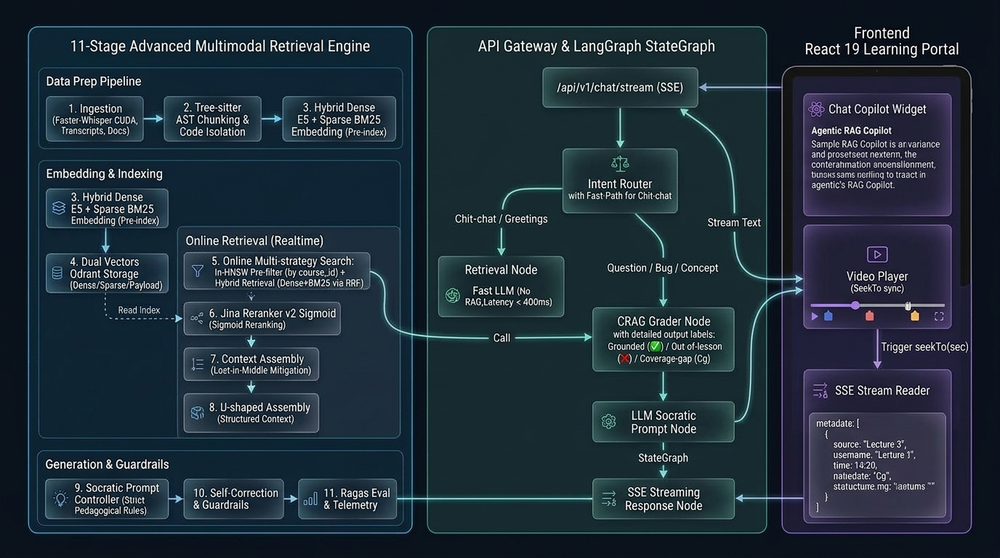
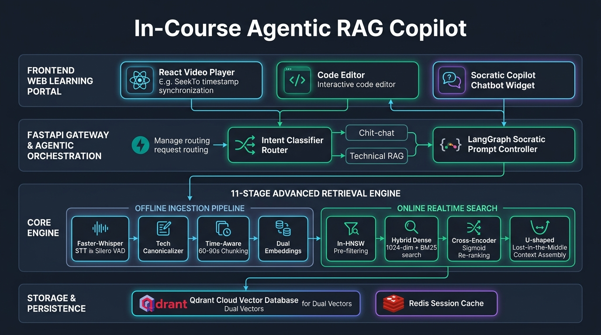

# In-Course Agentic RAG Copilot 🎓⚡

> **Enterprise Socratic AI Teaching Assistant with Synchronized Video Timestamp Seeking & AST Code Retrieval for Full-Stack Programming Education.**

[](https://www.python.org/)
[](https://fastapi.tiangolo.com/)
[](https://qdrant.tech/)
[](https://github.com/SYSTRAN/faster-whisper)
[](https://github.com/qdrant/fastembed)
[](LICENSE)

---

## 🌟 1. Tổng Quan Dự Án (Project Overview)

**In-Course Agentic RAG Copilot** là hệ thống trợ giảng AI thông minh tích hợp trực tiếp vào website học lập trình full-stack. Hệ thống giải quyết hai bài toán lớn nhất của việc học lập trình trực tuyến:
1. **Phương pháp sư phạm Socratic (Pedagogical Core):** Tuyệt đối **không giải bài tập hộ học viên** (tránh triệt tiêu tư duy lập trình). AI phân tích lỗi logic, giải thích nguyên nhân và đặt câu hỏi gợi mở từng bước để học viên tự viết code.
2. **Đồng bộ mốc thời gian Video đa phương thức (Video Timestamp Synchronization):** Thay vì đọc câu trả lời dài dòng, AI tự động trích xuất các thẻ mốc thời gian:
   ```html
   <timestamp sec="122">02:02</timestamp>
   ```
   Khi học viên bấm vào thẻ, trình phát video sẽ tự động tua (`player.seekTo(122)`) đến đúng đoạn giảng viên đang thao tác trên màn hình.

---

## 🏛️ 2. Sơ Đồ Kiến Trúc & Luồng Dữ Liệu (System Architecture)

Hệ thống được thiết kế theo mô hình **Agentic RAG điều phối Lõi Advanced RAG 11 giai đoạn**:

### A. Luồng Điều Phối Chi Tiết (Detailed Router Topology)


### B. Bản Vẽ Kiến Trúc Toàn Hệ Thống (System Architecture Blueprint)


---

## ⚙️ 3. Lõi 11-Stage Advanced Retrieval Engine

Hệ thống áp dụng đầy đủ 11 giai đoạn kỹ thuật chuyên sâu:

| Phân tầng | Giai đoạn | Kỹ thuật & Công nghệ | Mục đích giải quyết |
| :--- | :---: | :--- | :--- |
| **Offline Data Pipeline** | **Stage 1** | **Ingestion:** `faster-whisper` + `Silero VAD` | Tự động bóc tách giọng nói bài giảng, gán timestamp chính xác theo giây mà không cần phụ đề có sẵn. |
| | **Stage 2** | **Cleaning & Tech Canonicalizer** | Chuẩn hóa NFC, loại bỏ từ đệm, Regex sửa lỗi âm học tiếng Việt (`C++`, `C#`, `Ctrl`, `#include`). |
| | **Stage 3** | **Multi-strategy Chunking** | Cắt video theo khung thời gian **60–90s gối đầu 15s** (Time-aware) và cắt code theo cây cú pháp AST (`tree-sitter`). |
| | **Stage 4** | **Dual Embedding Generation** | Sinh đồng thời **Dense Vector** (1024-dim `multilingual-e5-large`) và **Sparse Vector** (`Qdrant/bm25`) qua `fastembed`. |
| | **Stage 5** | **Storage & Idempotent Indexing** | Nạp lên **Qdrant Cloud** với định danh tất định `UUIDv5` (chạy lại không trùng lặp) và 6 Payload Indexes. |
| **Online Realtime Search** | **Stage 6** | **Hybrid Retrieval** | Kết hợp tìm kiếm theo ý nghĩa (Dense Cosine) và từ khóa chính xác (Sparse BM25 DotProduct) qua RRF. |
| | **Stage 7** | **In-HNSW Dynamic Pre-filtering** | Lọc dữ liệu đơn tầng theo khóa học và tiến độ bài học hiện tại (`lesson_seq <= current`), chống lộ bài tương lai. |
| | **Stage 8** | **Re-ranking & Sigmoid Normalization** | Cross-Encoder xếp hạng lại, áp dụng công thức Sigmoid $\sigma(z) = \frac{1}{1 + e^{-z}}$ lấy ngưỡng thực $\ge 0.35$. |
| | **Stage 9** | **Context Assembly & Reordering** | Sắp xếp ngữ cảnh hình chữ U `[Top 1, Top 3, Top 2]` loại bỏ hiện tượng suy giảm chú ý "Lost-in-the-Middle". |
| **Agentic & Serving** | **Stage 10** | **Socratic Prompt Synthesizer** | Đóng vai trợ giảng 1-1, chống văn phong công nghiệp thô vụng (Single-pass Prompt Fusion) với chi phí 0đ. |
| | **Stage 11** | **Ragas / TruLens Telemetry** | Đo lường định lượng độ chính xác ngữ cảnh (Context Recall) và độ tin cậy câu trả lời (Faithfulness). |

---

## 🛠️ 4. Tech Stack Chuyên Sâu & Lý Do Lựa Chọn

* **Core Runtime:** `Python 3.11` (Hiệu năng cao, asyncio non-blocking, Pydantic v2).
* **Vector Database:** `Qdrant Cloud Managed Cluster` (Hỗ trợ Dual Named Vectors trong 1 Point, In-HNSW Pre-filtering dưới 5ms).
* **Embedding Engine:** `fastembed` (ONNX Runtime nhẹ, tốc độ suy luận $< 100$ms trên CPU, không bị phụ thuộc PyTorch 3GB cồng kềnh).
* **Speech-to-Text:** `faster-whisper` + `Silero VAD` (Nhanh gấp 4 lần Whisper gốc, tự động ngắt theo khoảng lặng tự nhiên).
* **Backend Gateway:** `FastAPI` + `Server-Sent Events (SSE)` (Stream token câu trả lời và metadata mốc thời gian thời gian thực).
* **Agentic State & Cache:** `LangGraph` + `Redis` (Quản lý phiên hội thoại Sliding Window 4–6 turns).

---

## 📁 5. Cấu Trúc Thư Mục Dự Án (Project Structure)

```text
In-Course_Agentic_RAG_Copilot/
├── .agents/skills/          # Quy trình Agile 4 tuần & Cheatsheet báo cáo hàng ngày
├── app/
│   ├── agent/               # Socratic System Prompts, Anti-Robotic Rules, Intent Router
│   ├── api/                 # FastAPI Routers & SSE Endpoints (/api/v1/chat/stream)
│   ├── services/            # Core Services: Ingestion, Retrieval, Qdrant Client
│   ├── schemas/             # Pydantic v2 Schemas (Chat, Metadata, Payload)
│   ├── config.py            # Pydantic BaseSettings đọc biến môi trường (.env)
│   └── main.py              # FastAPI Application Entrypoint
├── data/
│   ├── sample_codes/        # Bộ mã nguồn bài tập C++/Java mẫu phục vụ AST Chunking
│   │   └── cpp-core/        # lesson_01.cpp, lesson_02.cpp
│   └── transcripts/         # Dữ liệu phân đoạn bài giảng theo từng video
│       ├── c++/             # c++_chunks.json, c++_raw_segments.json, c++_report.md
│       └── c++_2/           # c++_2_chunks.json, c++_2_raw_segments.json, c++_2_report.md
├── docs/
│   ├── architecture/        # Sơ đồ kiến trúc & luồng dữ liệu (PNG high-res)
│   └── daily_reports/       # Nhật ký tiến độ báo cáo Giảng viên hướng dẫn hàng ngày
├── scripts/                 # CLI tools thực thi batch job
│   ├── ingest_video.py      # Pipeline nạp video, VAD, Canonicalizer, đẩy Qdrant Cloud
│   ├── reclean_transcripts.py # Script chuẩn hóa lại transcript mà không cần chạy lại Whisper
│   ├── test_search.py       # Công cụ kiểm thử Hybrid Search, Sigmoid Re-ranking & Stage 10 Demo
│   └── verify_qdrant.py     # Script kiểm tra trạng thái và số lượng points trên Qdrant Cloud
├── tests/                   # Kiểm thử tự động (Unit & Integration Tests)
├── docker-compose.yml       # Cấu hình Redis & môi trường dịch vụ
├── requirements.txt         # Danh sách thư viện phụ thuộc
├── AGENTS.md                # Quy tắc kiến trúc bất biến & Tiêu chuẩn kỹ thuật dự án
└── README.md                # Tài liệu hướng dẫn tổng quan dự án
```

---

## 🚀 6. Hướng Dẫn Cài Đặt & Chạy Nhanh (Quickstart)

### 1. Khởi tạo môi trường ảo
```powershell
python -m venv .venv
.\.venv\Scripts\activate
pip install -r requirements.txt
```

### 2. Cấu hình biến môi trường
Tạo file `.env` từ mẫu `.env.example`:
```ini
QDRANT_URL=https://<your-cluster-url>.qdrant.io
QDRANT_API_KEY=<your-api-key>
QDRANT_COLLECTION_NAME=In-Course_Agentic_RAG_Copilot
```

### 3. Nạp video bài giảng tự động (Ingestion Pipeline)
```powershell
.venv\Scripts\python scripts\ingest_video.py "C:\path\to\video.mp4" --course cpp-core --lesson lesson-01 --seq 1
```

### 4. Kiểm thử tìm kiếm mốc thời gian (Hybrid Retrieval & Socratic Demo)
```powershell
.venv\Scripts\python scripts\test_search.py "Tại sao dùng lệnh cout trong C++ lại bị báo đỏ gạch chân?" --seq 2
```

---

## 📅 7. Lộ Trình Triển Khai 4 Tuần (Roadmap)

* **Tuần 1: Data Pipeline & Multimodal Ingestion Engine** (Whisper VAD, Tech Canonicalizer, Time-aware Chunking, AST Code Dataset, Qdrant Cloud Cluster).
* **Tuần 2: Advanced Retrieval & Re-ranking Core** (Hybrid Search RRF, In-HNSW Pre-filtering, Cross-Encoder Sigmoid Re-ranking, U-shaped Assembly).
* **Tuần 3: Socratic Agentic Copilot & Streaming SSE Backend** (FastAPI SSE Endpoint, Intent Router, Socratic Prompt Engine, Redis Sliding Session).
* **Tuần 4: Evaluation, Frontend Integration & Defense Preparation** (Ragas Context Recall, React Video Player `seekTo` Integration, Báo cáo & Slide bảo vệ).

---

## 👨‍💻 Tác giả & Thông tin Đồ án
* **Sinh viên thực hiện:** Trần Thành Nghĩa (MSSV: `23DH112252`)
* **Trường Đại học:** Ngoại ngữ - Tin học TP.HCM (HUFLIT)
* **Kho mã nguồn:** [https://github.com/ThanhNghiaa-hehe/In-Course_Agentic_RAG_Copilot](https://github.com/ThanhNghiaa-hehe/In-Course_Agentic_RAG_Copilot)
