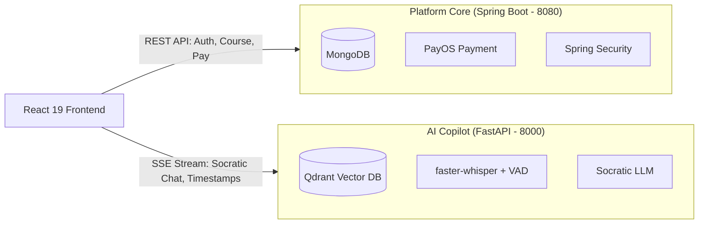

# TÀI LIỆU HỌC TẬP LÝ THUYẾT CHUYÊN SÂU (STUDENT THEORY LEARNING)
**Ngày thực hiện:** 21/09/2026  
**Sinh viên thực hiện:** Trần Thành Nghĩa (MSSV: `23DH112252`)  
**Đề tài:** In-Course Agentic RAG Copilot  
**Trường Đại học:** Ngoại ngữ - Tin học TP.HCM (HUFLIT)  

---

## 1. KIẾN TRÚC HYBRID DUAL-BACKEND VÀ NGUYÊN LÝ CÔ LẬP TÀI NGUYÊN (RESOURCE ISOLATION)

### 1.1. Tại sao không hợp nhất Spring Boot và FastAPI vào một Backend duy nhất?
Trong kỹ nghệ phần mềm cấp doanh nghiệp (Enterprise Software Engineering), việc lựa chọn kiến trúc không đơn thuần dựa trên sự tiện lợi nhất thời mà phải dựa trên **Bản chất khối lượng công việc (Workload Characteristics)**:

1. **Khối lượng công việc của Nền tảng Học tập (Transactional Workload - Spring Boot)**:
   * Bản chất: I/O-bound, yêu cầu độ trễ thấp, tuân thủ nghiêm ngặt tính toàn vẹn dữ liệu (ACID) cho các giao dịch tài chính (thanh toán PayOS), xác thực phân quyền người dùng (Spring Security + JWT), và quản lý tiến độ khóa học trong MongoDB.
   * JVM (Java Virtual Machine) tối ưu hóa xuất sắc cho các tác vụ đa luồng đồng thời (Multithreading), quản lý bộ nhớ ổn định và có hệ sinh thái thư viện doanh nghiệp vững chắc.

2. **Khối lượng công việc của Trợ giảng AI (Compute-intensive Workload - FastAPI)**:
   * Bản chất: CPU/GPU-bound và Tensor-bound. Quá trình tính toán nhúng vector (`multilingual-e5-large`), chấm điểm tương đồng cosine, bóc băng âm thanh (`faster-whisper`), và giải mã ngôn ngữ lớn (LLM) đòi hỏi các lệnh xử lý vector phần cứng (AVX-512, CUDA, Tensor Cores).
   * Hệ sinh thái AI/ML toàn cầu được xây dựng trên nền tảng C++/CUDA với Python làm giao diện điều khiển chuẩn mực (`ctranslate2`, `torch`, `tree-sitter`, `fastembed`).



### 1.2. Phân Tích Các Giải Pháp Phản Mẫu (Anti-Patterns)
* **Anti-Pattern 1: Gọi Python qua `ProcessBuilder` từ Java**:
  * Mỗi khi sinh viên đặt câu hỏi, JVM phải fork một tiến trình hệ điều hành để chạy script Python.
  * *Hậu quả:* Chi phí khởi tạo tiến trình (Process Overhead) làm tăng độ trễ lên 2–5 giây; rò rỉ RAM (Memory Leak) khi tiến trình con không được giải phóng kịp thời; khóa chết (block) các worker thread của Tomcat.
* **Anti-Pattern 2: Dùng Jython hoặc Java AI Wrappers chưa hoàn thiện**:
  * Jython chỉ hỗ trợ Python 2.7, hoàn toàn không tương thích với PyTorch hoặc Hugging Face.
  * Các wrapper C++ qua JNI (Java Native Interface) dễ gây lỗi `Segmentation Fault` làm sập toàn bộ máy chủ JVM của cả trang web.
* **Chuẩn Mực Giải Pháp (Microservice / AI Sidecar)**:
  * Tách biệt 2 tiến trình độc lập. Khi Copilot tính toán tải cao hoặc gặp sự cố, nền tảng học tập chính vẫn đảm bảo hoạt động 100%, không gián đoạn việc học và thanh toán của người dùng.

---

## 2. NGUYÊN LÝ CONTEXTUAL BIASING TRONG AUTOMATIC SPEECH RECOGNITION (ASR)

### 2.1. Kiến Trúc Encoder-Decoder Của Whisper
Whisper (Radford et al., 2022) là mô hình biến đổi chuỗi sang chuỗi (Sequence-to-Sequence Transformer):
1. **Audio Encoder**: Nhận biểu đồ phổ âm thanh (Log-mel Spectrogram) $X$, trích xuất đặc trưng âm học qua 2 lớp tích chập (1D Convolution) và một chuỗi các khối Transformer Encoder:
   $$H = \text{Encoder}(X)$$
2. **Text Decoder**: Dự đoán từng token văn bản tiếp theo $w_t$ dựa trên các token đã sinh trước đó $w_{<t}$ và biểu diễn âm học $H$:
   $$P(w_t \mid w_{<t}, X) = \text{Softmax}\left(\frac{Q K^T}{\sqrt{d_k}}\right) V$$

### 2.2. Cơ Chế Toán Học Của `hotwords` (Contextual Logit Biasing)
Trong các bài giảng kỹ thuật, các từ mượn tiếng Anh (Loanwords) phát âm theo ngữ điệu Việt rất dễ bị bộ giải mã hiểu nhầm thành các từ vựng phổ thông tiếng Việt. Khi cấu hình `DOMAIN_HOTWORDS`, hệ thống áp dụng kỹ thuật **Logit Biasing**:

$$\text{Logits}'(w) = \text{Logits}(w) + \beta \cdot \mathbb{I}(w \in \mathcal{V}_{\text{domain}})$$

Trong đó:
* $\mathcal{V}_{\text{domain}}$ là tập hợp các token thuộc từ điển chuyên ngành (`cout`, `iostream`, `vector`, `virtual`, `destructor`).
* $\beta > 0$ là trọng số ưu tiên âm học.
* $\mathbb{I}(\cdot)$ là hàm chỉ thị (Indicator Function).

Nhờ đó, tại mỗi bước giải mã Beam Search, các ứng viên token lập trình được cộng thêm một lượng xác suất tiên nghiệm (Prior Probability), giúp Decoder vượt qua các bẫy đồng âm âm học mà không làm sai lệch cấu trúc ngữ pháp tổng thể của câu.

---

## 3. CƠ CHẾ SYMLINK/JUNCTION RESOLUTION TRONG BỘ ĐÓNG GÓI VITE & ROLLUP

### 3.1. Bản Chất Của NTFS Directory Junctions
* **NTFS Junction** là một dạng Reparse Point đặc thù của hệ điều hành Windows, trỏ một thư mục này sang một thư mục khác trên cùng ổ đĩa cục bộ ở tầng file system driver.
* Khác với Hard Link (chỉ áp dụng cho file), Junction áp dụng cho thư mục mà không đòi hỏi quyền quản trị viên cao nhất (Admin privileges) như Symbolic Link trên Windows.

### 3.2. Xung Đột Đường Dẫn Với Rollup `emitFile`
Khi Vite đóng gói mã nguồn:
1. Node.js `fs.realpath` ngầm phân giải đường dẫn Junction `d:\...\external_fe` về đường dẫn vật lý thực tế `D:\LapTrinhWebNangCao\FE_Call_API\fe-codelearning`.
2. Rollup FileEmitter yêu cầu: Mọi file chunk hoặc asset được phát ra (`fileName` hoặc `name`) phải là một chuỗi đường dẫn tương đối nội bộ, tuyệt đối không được chứa ký tự điều hướng thư mục cha (`../`).
3. Khi không có cờ `preserveSymlinks`, Rollup tính toán đường dẫn tương đối giữa thư mục làm việc hiện tại (`cwd`) và tệp vật lý, sinh ra chuỗi `../../LapTrinhWebNangCao/.../index.html` $\rightarrow$ Kích hoạt ngoại lệ cấm đường dẫn ngoài root.
4. **Giải pháp chuẩn hóa:**
   ```javascript
   resolve: {
     preserveSymlinks: true
   }
   ```
   Cờ này hướng dẫn Node.js và Vite giữ nguyên cấu trúc đường dẫn ảo theo điểm liên kết Junction, ngăn chặn việc phân giải về đường dẫn thực tế, giải quyết triệt để lỗi đóng gói.

---

## 4. BỘ CÂU HỎI PHẢN BIỆN BẢO VỆ ĐỒ ÁN (DEFENSE Q&A)

### Câu 1: Tại sao em không gộp toàn bộ Backend về một ngôn ngữ Java hoặc Python duy nhất để dễ triển khai?
> **Trả lời:**  
> Hệ thống áp dụng nguyên lý **Kiến trúc đa ngôn ngữ (Polyglot Microservices)** để tối ưu hóa theo bản chất tài nguyên:
> 1. Spring Boot (Java 17) vượt trội về an toàn giao dịch, tích hợp thanh toán PayOS và quản lý bảo mật RBAC với MongoDB.
> 2. FastAPI (Python 3.11) là môi trường tối ưu cho xử lý AI/RAG nhờ sự hỗ trợ native của các thư viện tính toán vector C++/CUDA (`fastembed`, `ctranslate2`, `tree-sitter`).
> Việc tách rời hai backend giúp cô lập lỗi (Fault Isolation): nếu AI xử lý tác vụ nặng gây quá tải, hệ thống học tập và thanh toán chính vẫn hoạt động ổn định 100%.

### Câu 2: Tính năng `hotwords` trong Whisper có nguy cơ làm mô hình phiên âm sai các từ thông thường sang từ lập trình không?
> **Trả lời:**  
> Không. `hotwords` chỉ đóng vai trò là một lượng bias nhẹ ($\beta$) vào logits trong quá trình Beam Search Decoding, chứ không ép buộc thay thế cứng. Nếu âm thanh đầu vào hoàn toàn không mang đặc trưng âm học tương đồng với từ khóa trong `hotwords`, xác suất dự đoán của từ khóa đó vẫn ở mức rất thấp và sẽ bị hàm Softmax triệt tiêu. Ngoài ra, hệ thống áp dụng cơ chế phòng thủ 2 lớp: sau khi Whisper phiên âm, bộ `Tech Canonicalizer` tiếp tục kiểm tra ngữ cảnh trước khi đưa vào pipeline lưu trữ.

### Câu 3: Làm thế nào frontend điều khiển được mốc thời gian của video khi video được nhúng qua YouTube Iframe?
> **Trả lời:**  
> YouTube Iframe được khởi tạo với cờ `enablejsapi=1`. Khi người dùng click vào thẻ `<timestamp sec="...">` do Socratic AI cung cấp, frontend sử dụng API `window.postMessage` chuẩn của trình duyệt để gửi gói tin:
> ```json
> {
>   "event": "command",
>   "func": "seekTo",
>   "args": [seconds, true]
> }
> ```
> Gói tin này được YouTube Iframe Player tiếp nhận an toàn xuyên domain (Cross-origin communication) và thực thi tua video đến đúng giây cần xem mà không gây tải lại trang.
