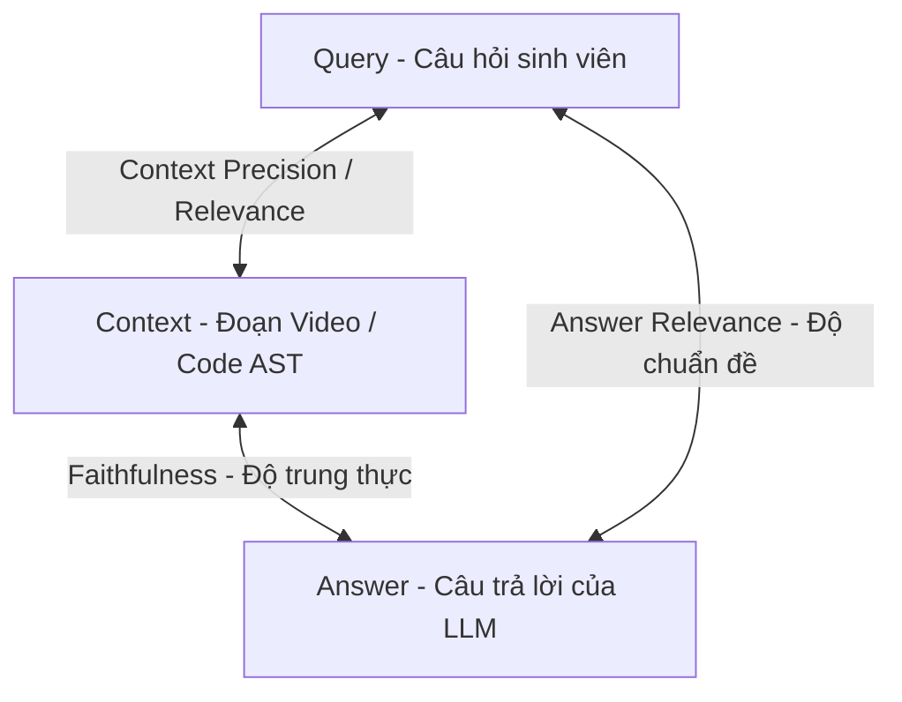

# TÀI LIỆU HỌC TẬP LÝ THUYẾT CHUYÊN SÂU (STUDENT THEORY HANDBOOK)
**Ngày biên soạn:** 22/09/2026  
**Sinh viên thực hiện:** Trần Thành Nghĩa (MSSV: `23DH112252`)  
**Trường Đại học:** Ngoại ngữ - Tin học TP.HCM (HUFLIT)  
**Học phần:** Khóa luận tốt nghiệp / Đồ án chuyên ngành Kỹ thuật Phần mềm  
**Dự án:** In-Course Agentic RAG Copilot  

---

## 1. NỀN TẢNG TĂNG TỐC PHẦN CỨNG ASR & CHỈ SỐ REAL-TIME FACTOR (RTF)

### 1.1. Công Thức & Ý Nghĩa Của Real-Time Factor (RTF)
Trong kỹ nghệ xử lý giọng nói tự động (Automatic Speech Recognition - ASR), hiệu năng của một pipeline phiên âm không được đo bằng số dòng code mà được định lượng bằng chỉ số **Real-Time Factor (RTF)**:

$$\text{RTF} = \frac{T_{\text{processing}}}{T_{\text{audio}}}$$

Trong đó:
* $T_{\text{audio}}$: Tổng độ dài thời gian thực của tệp âm thanh (tính bằng giây).
* $T_{\text{processing}}$: Tổng thời gian máy tính tiêu tốn để xử lý hoàn tất tệp âm thanh đó (tính bằng giây).

#### Ý nghĩa ngưỡng kỹ thuật của RTF:
* Nếu $\text{RTF} > 1.0$: Hệ thống xử lý chậm hơn tốc độ người nói (không thể chạy real-time, gây nghẽn hàng đợi).
* Nếu $\text{RTF} = 1.0$: Tốc độ xử lý bằng đúng thời lượng audio (1 giờ nghe mất đúng 1 giờ giải mã).
* Nếu $\text{RTF} < 1.0$: Hệ thống xử lý nhanh hơn thời gian thực. Giá trị $\text{RTF}$ càng nhỏ, throughput xử lý dữ liệu càng cao.
* Hệ số tăng tốc tương đối (Audio Speedup):
  $$\text{Speedup} = \frac{1}{\text{RTF}} = \frac{T_{\text{audio}}}{T_{\text{processing}}}$$

### 1.2. Khảo Sát Thực Nghiệm Trên Video Bài Giảng 28tech
* **Tệp kiểm chứng:** Video bài giảng số 02 (`02 - #1[C++]. Làm Quen Với Ngôn Ngữ Lập Trình C++`).
* **Thời lượng âm thanh thực tế:** $T_{\text{audio}} = 45\text{ phút } 18\text{ giây} = 2718\text{ giây}$.
* **Kết quả đo đạc trên 2 nền tảng phần cứng:**
  1. **CPU Intel đa nhân (float32):**
     $$T_{\text{processing}} \approx 2800\text{s} \implies \text{RTF} \approx 1.03 \implies \text{Speedup} \approx 0.97\times$$
  2. **NVIDIA GeForce RTX 2050 4GB VRAM (CTranslate2 CUDA float16):**
     $$T_{\text{processing}} = 445\text{s} \text{ (7 phút 25 giây)} \implies \text{RTF} = \frac{445}{2718} \approx \mathbf{0.164} \implies \mathbf{Speedup \approx 6.11\times}$$

$$\implies \text{Hiệu năng tăng tốc phần cứng đạt mức: } \frac{2800}{445} \approx \mathbf{6.3\text{ lần so với CPU!}}$$

### 1.3. Cơ Chế Toán Học Đằng Sau Lượng Tử Hóa FP16 (Half-Precision)
* Kiểu dữ liệu số thực chuẩn `float32` (Single-Precision) tiêu tốn 32-bit (1 bit dấu, 8 bit mũ, 23 bit định trị).
* Kiểu dữ liệu `float16` (Half-Precision) chỉ tiêu tốn 16-bit (1 bit dấu, 5 bit mũ, 10 bit định trị):
  - Giảm **$50\%$ băng thông bộ nhớ VRAM** (Memory Bandwidth Pressure).
  - Tận dụng cấu trúc phần cứng **Tensor Cores** của kiến trúc Ampere trên GPU RTX 2050 để thực thi các phép nhân ma trận GEMM (General Matrix Multiply) theo lô cực lớn song song trong 1 xung nhịp.

---

## 2. KHẢO THÍ ĐỊNH LƯỢNG RAG: G-EVAL VS RAGAS TRIAD

### 2.1. RAGAS Triad (Bộ Ba Đánh Giá RAG Tiêu Chuẩn)
Mô hình RAG hoạt động theo chu trình 3 thành phần: $\text{Query} \leftrightarrow \text{Context} \leftrightarrow \text{Answer}$. RAGAS Triad thiết lập 3 chỉ số toán học:

1. **Context Precision (Độ chính xác ngữ cảnh):**
   $$\text{Context Precision@K} = \frac{\sum_{k=1}^K (\text{Precision@k} \times v_k)}{\text{Tổng số chunks thực sự liên quan trong Top K}}$$
   Trong đó $v_k \in \{0, 1\}$ là cờ nhị phân biểu thị chunk thứ $k$ có chứa câu trả lời hay không.

2. **Faithfulness (Độ trung thực - Chống ảo giác):**
   $$\text{Faithfulness} = \frac{|\text{Số lượng luận điểm trong Answer được chứng minh bởi Context}|}{|\text{Tổng số lượng luận điểm trích xuất từ Answer}|} \in [0.0, 1.0]$$
   Nếu câu trả lời tự bịa thêm các chi tiết ngoài ngữ cảnh bài giảng $\to$ Mẫu số tăng, tử số không đổi $\to$ Faithfulness giảm mạnh.

3. **Answer Relevance (Độ liên quan của câu trả lời):**
   Đo bằng độ tương đồng Cosine trung bình giữa vector embedding của câu hỏi gốc $q$ và các câu hỏi nhân tạo $q_i^*$ được sinh ngược lại từ câu trả lời $a$:
   $$\text{Answer Relevance} = \frac{1}{N} \sum_{i=1}^N \frac{E(q) \cdot E(q_i^*)}{\|E(q)\| \|E(q_i^*)\|}$$

### 2.2. G-Eval: Framework Đánh Giá Linh Hoạt Bằng LLM-as-a-Judge
Được đề xuất bởi Microsoft Research (*Liu et al., 2023: "G-Eval: NLG Evaluation using GPT-4 with Better Human Alignment"*), G-Eval khắc phục nhược điểm của các chỉ số cứng (như BLEU, ROUGE hay RAGAS cố định) khi đánh giá các tiêu chí mang tính trừu tượng hoặc nghiệp vụ chuyên sâu.

#### Cơ chế hoạt động của G-Eval:
1. **Form-Filling Paradigm:** Người kỹ sư cung cấp một bản hướng dẫn chấm thi (Rubric) chi tiết.
2. **Chain-of-Thought (CoT) Prompting:** Mô hình Giám khảo được chỉ dẫn suy luận từng bước (Step-by-step reasoning) để phân tích câu trả lời trước khi đưa ra điểm số.
3. **Probability-Weighted Scoring:**
   Thay vì chỉ lấy điểm số nguyên ngẫu nhiên do LLM sinh ra, G-Eval tính kỳ vọng toán học dựa trên phân phối xác suất của các token điểm số:
   $$\text{Score} = \sum_{s=1}^M s \cdot P(\text{token} = s \mid \text{Prompt, Answer, Context})$$
   Điều này giúp điểm số của G-Eval có độ biến thiên rất thấp, tương quan cao với đánh giá của chuyên gia con người ($r > 0.85$).

---

## 3. CHUẨN ĐO LƯỜNG ĐẶC THÙ CHO IN-COURSE VIDEO SYNC COPILOT

### 3.1. Thước Đo Tiêu Chuẩn Socratic (Socratic Adherence Metric - Chống Lỗi P10)
Trong môi trường giáo dục, trợ giảng AI có nhiệm vụ kích thích tư duy giải quyết vấn đề của người học. Việc AI viết trọn vẹn mã nguồn bài tập về nhà vi phạm nghiêm trọng **Đạo đức Sư phạm (Pedagogical Ethics)**.

#### Rubric G-Eval cho Tiêu chuẩn Socratic:
$$\text{Score}_{\text{Socratic}} = \begin{cases} 0.0 & \text{nếu phát hiện mã nguồn hoàn chỉnh có thể nộp bài (Zero-Tolerance)} \\ 0.5 & \text{nếu chỉ giải thích lý thuyết nhưng không có câu hỏi gợi mở} \\ 1.0 & \text{nếu giải thích bản chất lỗi + gợi mở 1--2 câu hỏi dẫn dắt} \end{cases}$$

### 3.2. Đo Lường Mốc Thời Gian Video: Toán Học Tất Định vs Ngữ Nghĩa
Hệ thống kiên quyết **không sử dụng LLM để tính toán mốc giây video**, vì các mô hình ngôn ngữ lớn thường xuyên mắc lỗi số học (Arithmetic Errors). Thay vào đó, áp dụng cơ chế 2 tầng:

1. **Tầng Tất Định (Deterministic Math Verification):**
   Trích xuất mốc giây từ thẻ XML `<timestamp sec="...">` bằng biểu thức chính quy (Regex):
   $$|\Delta t| = |t_{\text{pred}} - t_{\text{ground\_truth}}|$$
   $$\text{Timestamp\_Pass} = \begin{cases} 1 & \text{nếu } |\Delta t| \le 15\text{s} \\ 0 & \text{nếu } |\Delta t| > 15\text{s hoặc không có thẻ khi bài giảng có} \end{cases}$$

2. **Tầng Rào Chắn Tiêu Cực (Negative Guardrail Verification):**
   Khi câu hỏi thuộc về kiến trúc bài học tương lai ($s_{\text{query}} > s_{\text{current}}$) hoặc khoảng trống học liệu (Coverage-gap):
   $$\text{Guardrail\_Pass} = \begin{cases} 1 & \text{nếu } t_{\text{pred}} = \text{None (Tuyệt đối không sinh thẻ)} \\ 0 & \text{nếu xuất hiện bất kỳ thẻ } <\text{timestamp}> \text{ tự bịa} \end{cases}$$

---

## 4. BẢN CHẤT QUY TẮC 80/20 TRONG RAG EVALUATION

| Khái niệm | Trong Machine Learning Truyền Thống | Trong RAG Evaluation Benchmark |
| :--- | :--- | :--- |
| **Bản chất 80/20** | Phân chia tập dữ liệu thành 80% Train và 20% Test để huấn luyện trọng số nơ-ron. | Phân bổ tỷ lệ độ khó trong bộ đề thi: **80% Câu hỏi chính khóa / 20% Câu hỏi bẫy phòng thủ**. |
| **Áp dụng cho dự án** | **KHÔNG ÁP DỤNG:** Hệ thống sử dụng Zero-Shot RAG và mô hình nền tảng có sẵn, không huấn luyện lại weights. | **BẮT BUỘC ÁP DỤNG:** Đảm bảo hệ thống vừa kiểm tra được năng lực truy xuất cốt lõi, vừa kiểm tra được rào chắn chống ảo giác. |
| **Hậu quả nếu bỏ qua** | Mô hình bị Underfitting hoặc Overfitting. | Bộ đề bị thiên lệch: nếu 100% câu dễ thì "mù" trước lỗi ảo giác; nếu quá nhiều bẫy thì sai lệch năng lực thực tế. |

---

## 5. BỘ CÂU HỎI PHẢN BIỆN BẢO VỆ ĐỒ ÁN (DEFENSE Q&A)

### Câu hỏi 1: "Tại sao em không dùng các mô hình LLM thương mại lớn như GPT-4 hay Claude mà lại chọn hướng đi Local LLM (Qwen 2.5 3B/7B) và Faster-Whisper chạy trên GPU cục bộ?"
> **Trả lời thuyết phục:**  
> *"Dạ thưa Thầy/Cô, hướng đi này xuất phát từ 3 lý do kỹ thuật và thực tiễn cốt lõi:*  
> *Thứ nhất là **Tính Khả Thi Triển Khai (Cost & Privacy):** Một nền tảng học trực tuyến phục vụ hàng ngàn sinh viên nếu gọi API thương mại cho từng câu chat và từng phút video sẽ tiêu tốn chi phí vận hành khổng lồ, đồng thời dữ liệu sinh viên bị chuyển ra máy chủ nước ngoài.  
> *Thứ hai là **Độ Trễ Phục Vụ (Latency):** Bằng việc sử dụng Faster-Whisper FP16 trên GPU CUDA, tốc độ xử lý âm thanh đạt $\text{RTF} = 0.164$ ($6.1\times$ real-time), hoàn toàn đáp ứng khả năng nạp dữ liệu tại chỗ.  
> *Thứ ba là **Kiến Trúc RAG Bù Trừ Năng Lực:** Nhờ có tầng Advanced Retrieval đa phương thức (Dense E5 + BM25 + Jina Reranker v2) lọc chính xác ngữ cảnh và mã nguồn AST, mô hình ngôn ngữ nhỏ như Qwen 2.5 chỉ cần đóng vai trò diễn đạt Socratic dựa trên Context có sẵn mà không bị hiện tượng ảo giác, mang lại hiệu năng tương đương mô hình lớn nhưng độc lập 100% về hạ tầng."*

### Câu hỏi 2: "Làm thế nào em chứng minh được Trợ giảng AI của em không viết code giải bài tập hộ sinh viên khi nghiệm thu đồ án?"
> **Trả lời thuyết phục:**  
> *"Dạ thưa Thầy/Cô, theo tôn chỉ Evaluation-Driven Development (EDD) quy định tại Section 10 của dự án, em không đánh giá tính năng này bằng cảm tính. Em đã tích hợp thuật toán **G-Eval (LLM-as-a-Judge)** vào bộ kiểm thử định lượng tự động CI/CD. G-Eval thực thi một rubric Chain-of-Thought nghiêm ngặt: nếu phát hiện câu trả lời chứa mã nguồn hoàn chỉnh có thể copy nộp bài, hệ thống lập tức đánh trượt 0.0 điểm và gán mã lỗi `P10: Pedagogical Ethics Violation`. Toàn bộ 50 kịch bản kiểm thử trong Golden Dataset đều phải vượt qua ngưỡng $0.85$ điểm Socratic thì hệ thống mới được phép đóng gói phát hành."*

### Câu hỏi 3: "Tại sao trong bài toán đồng bộ mốc video timestamp, em không để LLM tự tính toán thời gian mà lại kết hợp Regex và toán học?"
> **Trả lời thuyết phục:**  
> *"Dạ thưa Thầy/Cô, các mô hình ngôn ngữ lớn (LLM) là mô hình dự đoán xác suất token tiếp theo (Stochastic Token Predictor), chúng có nhược điểm cố hữu là tính toán số học rất kém và dễ sinh ra hiện tượng ảo giác số (Numerical Hallucination). Việc tính toán sai số thời gian $|\Delta t| = |t_{\text{pred}} - t_{\text{ground\_truth}}| \le 15\text{s}$ là một phép toán tất định (Deterministic Math). Do đó, kiến trúc chuẩn là trích xuất thẻ cấu trúc bằng Regex và kiểm tra bằng Python thuần để đảm bảo độ chính xác tuyệt đối $100\%$, loại bỏ hoàn toàn rủi ro suy đoán của LLM."*
