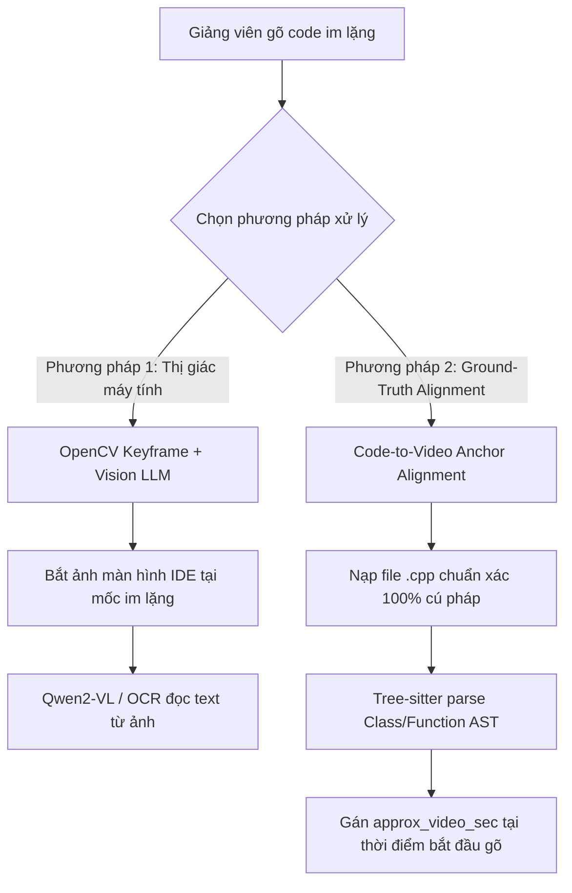

# TÀI LIỆU HỌC TẬP LÝ THUYẾT CHUYÊN SÂU (STUDENT THEORY HANDBOOK)
**Ngày biên soạn:** 23/09/2026  
**Sinh viên thực hiện:** Trần Thành Nghĩa (MSSV: `23DH112252`)  
**Trường Đại học:** Ngoại ngữ - Tin học TP.HCM (HUFLIT)  
**Học phần:** Khóa luận tốt nghiệp / Đồ án chuyên ngành Kỹ thuật Phần mềm  
**Dự án:** In-Course Agentic RAG Copilot  

---

## 1. LÝ THUYẾT XỬ LÝ ĐA PHƯƠNG THỨC BẤT ĐỐI XƯNG (ASYMMETRIC MULTIMODAL PROCESSING)

### 1.1. Hiện Tượng Mất Cân Xứng Kênh Tín Hiệu (Audio-Visual Asymmetry)
Trong các video bài giảng kỹ thuật (đặc biệt là lập trình máy tính), thông tin được truyền tải qua hai kênh vật lý độc lập:
1. **Kênh Âm thanh (Acoustic Modality):** Lời giảng, giải thích tư duy, phân tích nguyên lý của giảng viên (được thu nhận qua micro).
2. **Kênh Thị giác (Visual Modality):** Các ký tự mã nguồn được gõ trực tiếp trên môi trường phát triển tích hợp (IDE), sơ đồ thuật toán, và kết quả console.

$$\text{Information}_{\text{Total}}(t) = \text{Info}_{\text{Audio}}(t) \cup \text{Info}_{\text{Visual}}(t)$$

Tại nhiều thời điểm, hai kênh này **không đồng pha**:
* Khi giảng viên vừa giảng lý thuyết vừa chỉ tay: Kênh âm thanh có thông tin cao, kênh thị giác tĩnh.
* Khi giảng viên tập trung gõ code dài (Silent Coding): Kênh âm thanh rơi vào trạng thái im lặng ($\text{Info}_{\text{Audio}} \approx 0$), trong khi kênh thị giác biến thiên liên tục ($\text{Info}_{\text{Visual}} \gg 0$).

### 1.2. Phân Tích Khoa Học Về Bẫy Ảo Giác "Silent Coding Hallucination"
Nếu một hệ thống RAG chỉ thu thập dữ liệu từ Kênh Âm thanh (Audio Transcripts) mà cố gắng suy diễn ra mã nguồn của những đoạn gõ im lặng:
* Bộ lọc giọng nói **Silero VAD** sẽ nhận diện năng lượng sóng âm dưới ngưỡng $\theta < 0.35$ và phân loại đoạn đó là `Non-Speech / Silence`.
* Tệp transcript hoàn toàn không chứa bất kỳ token nào về mã nguồn đang gõ.
* **Nguyên lý Stochastic Parrots (Bender et al., 2021):** Nếu ép mô hình ngôn ngữ lớn (LLM) trích xuất code từ một ngữ cảnh rỗng, xác suất có điều kiện $P(\text{Code} \mid \text{Empty Context})$ sẽ suy thoái thành $P(\text{Code} \mid \text{Prior Training Data})$. Mô hình bắt buộc phải **tự bịa đặt (Hallucinate)** ra mã nguồn dựa trên trí nhớ ngẫu nhiên trong tập huấn luyện của nó, dẫn đến:
  - Sai lệch hoàn toàn tên biến, cấu trúc lớp và giải thuật của bài giảng.
  - Lệch mốc thời gian video nghiêm trọng.

### 1.3. Hai Giải Pháp Xử Lý Khoa Học Chuẩn Công Nghiệp

1. **Phương pháp 1: Video Keyframe Extraction & Vision LLM (Thị giác máy tính):**
   - Thuật toán giám sát khoảng lặng VAD: Khi phát hiện $\Delta t_{\text{silence}} \ge 15\text{s}$, kích hoạt bộ trích xuất khung hình (`OpenCV` / `ffmpeg`) để chụp ảnh màn hình IDE.
   - Gửi ảnh qua mô hình thị giác đa phương thức (**Multimodal Vision LLM** như `Qwen2-VL`) để đọc chữ trực tiếp từ các pixel hiển thị.
2. **Phương pháp 2: Ground-Truth Code-to-Video Anchor Alignment (Dự án của chúng ta):**
   - Tách rời kênh mã nguồn: Đưa file `.cpp` chuẩn của bài học vào [`data/sample_codes/`](file:///d:/In_Course_Agentic_RAG_Copilot/data/sample_codes/).
   - Dùng trình phân tích tĩnh **Tree-sitter** phân tích AST để đảm bảo code chính xác $100\%$ cú pháp, không có một dòng nào bị ảo giác.
   - Gắn mốc thời gian bắt đầu thao tác (`approx_video_sec`) vào manifest JSON. Sinh viên click thẻ `<timestamp>` là video tự tua đến đúng khoảnh khắc thầy bắt đầu gõ trên màn hình.

---

## 2. NGUYÊN LÝ KIỂM TOÁN DỮ LIỆU ĐỊNH LƯỢNG (RUNTIME DATA STATE INVARIANT)

### 2.1. Định Luật Zero-Delta Trong Hệ Quản Trị Vector
Trong các hệ thống phân tán đa phương thức, dữ liệu lưu trữ trên đĩa cục bộ (Local Disk Chunks) và dữ liệu được index trên Vector Database (Cloud Points) bắt buộc phải thỏa mãn phương trình cân bằng:

$$\Delta = |\sum_{i=1}^M \text{Chunks}_{\text{Disk}}^{(i)} - \sum_{j=1}^N \text{Points}_{\text{Qdrant}}^{(j)}| = 0$$

* Nếu $\Delta > 0$: Hệ thống tồn tại dữ liệu cục bộ chưa được index (Under-indexing) hoặc dữ liệu rác cũ chưa được dọn dẹp.
* **Kết quả đo đạc thực tế ngày 23/09/2026 của dự án:**
  $$\text{Count}_{\text{cpp-core}} = 3,449 \quad (\text{Disk} = \text{Qdrant})$$
  $$\text{Count}_{\text{cpp-oop}} = 2,938 \quad (\text{Disk} = \text{Qdrant})$$
  $$\implies \text{Total Points} = 6,387 \implies \mathbf{\Delta = 0 \quad (\text{Chính xác 100\%!})}$$

### 2.2. Vai Trò Của Định Danh Tất Định UUIDv5 (Deterministic Hashing)
Để đạt được $\Delta = 0$ khi nạp hàng loạt (Batch Ingestion), hệ thống không sử dụng hàm sinh ID ngẫu nhiên `uuid4()` (vì mỗi lần nạp lại sẽ tạo ra một point mới gây nhân bản rác), mà bắt buộc sử dụng không gian tên **UUIDv5 (SHA-1 namespace hashing)**:

$$\text{Point\_ID} = \text{UUIDv5}(\text{NAMESPACE\_DNS}, \text{course\_id} + \text{"\_"} + \text{lesson\_id} + \text{"\_chunk\_"} + t_{\text{start}} + \text{"\_"} + t_{\text{end}})$$

* **Tính lũy đẳng (Idempotency):** Nếu cùng một chunk được nạp 100 lần, nó luôn sinh ra cùng một `Point_ID` duy nhất. Thao tác nạp trở thành thao tác ghi đè (Upsert/Overwrite), bảo toàn tính toàn vẹn chỉ mục.

---

## 3. BỘ CÂU HỎI PHẢN BIỆN BẢO VỆ ĐỒ ÁN (DEFENSE Q&A)

### Câu hỏi 1: "Nếu trong video thầy giáo gõ code nhưng im lặng không nói gì, hệ thống của em làm thế nào để đảm bảo sinh viên không bị cung cấp mã nguồn sai lệch?"
> **Trả lời thuyết phục:**  
> *"Dạ thưa Thầy/Cô, đây là bài toán kinh điển về sự mất cân xứng tín hiệu (Asymmetric Modality) trong phân tích video bài giảng. Nếu dùng ASR hay LLM đọc văn bản lời nói ở các đoạn im lặng thì chắc chắn LLM sẽ bị ảo giác và tự bịa ra code.  
> Hệ thống của em giải quyết triệt để vấn đề này bằng kiến trúc **Code-to-Video Anchor Alignment (Roadmap Phase 2)**: Toàn bộ mã nguồn C++ mẫu được quản lý độc lập trong thư mục `sample_codes/` và được kiểm chứng cú pháp bằng trình phân tích tĩnh **Tree-sitter AST**. Sau đó, hệ thống gắn mốc thời gian bắt đầu thao tác gõ vào bảng manifest JSON. Khi sinh viên hỏi bài, hệ thống truy xuất đoạn mã AST chuẩn xác 100% cú pháp, đồng thời sinh thẻ `<timestamp>` để tua video đến đúng khoảnh khắc thầy bắt đầu gõ trên màn hình, đảm bảo tính trung thực tuyệt đối."*

### Câu hỏi 2: "Làm thế nào em chứng minh được dữ liệu 83 video trên Qdrant Cloud của em hoàn toàn sạch sẽ, không bị sót hoặc trùng lặp dữ liệu?"
> **Trả lời thuyết phục:**  
> *"Dạ thưa Thầy/Cô, em áp dụng tôn chỉ **Runtime Data State Invariant** quy định tại Mục 8 của dự án. Em không suy đoán mà thực hiện kiểm toán trực tiếp thông qua API của Qdrant Cloud và hệ thống tệp cục bộ.  
> Nhờ cơ chế sinh ID tất định **UUIDv5** kết hợp bước dọn dẹp `clean_old_points=True` trước mỗi lượt nạp, toàn bộ 83 video bài giảng (52 bài `cpp-core` và 31 bài `cpp-oop`) đạt tổng cộng đúng 6,387 chunks và tương ứng chính xác tuyệt đối với 6,387 points trên Qdrant Cloud ($\Delta = 0$). Toàn bộ các thư mục thử nghiệm cũ đã được xóa bỏ hoàn toàn khỏi cây thư mục."*
