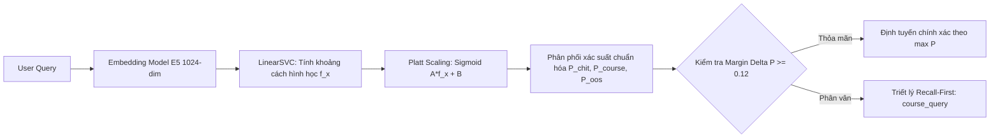

# TÀI LIỆU HỌC TẬP LÝ THUYẾT CHUYÊN SÂU (STUDENT THEORY HANDBOOK)
**Ngày biên soạn:** 24/09/2026 - Rạng sáng 25/09/2026  
**Sinh viên thực hiện:** Trần Thành Nghĩa (MSSV: `23DH112252`)  
**Trường Đại học:** Ngoại ngữ - Tin học TP.HCM (HUFLIT)  
**Học phần:** Khóa luận tốt nghiệp / Đồ án chuyên ngành Kỹ thuật Phần mềm  
**Dự án:** In-Course Agentic RAG Copilot  

---

## 1. NGUYÊN LÝ HIỆU CHUẨN XÁC SUẤT MÔ HÌNH TUYẾN TÍNH (PLATT SCALING)

### 1.1. Bản Chất Hình Học Của Linear Support Vector Classifier (LinearSVC)
Mô hình Linear Support Vector Classifier tối ưu hóa một siêu phẳng phân tách cực đại (Maximum Margin Hyperplane) trong không gian vector đa chiều ($D = 1024$ từ `multilingual-e5-large`):

$$f(x) = \mathbf{w}^T x + b$$

Khoảng cách có dấu từ điểm dữ liệu $x$ đến siêu phẳng phản ánh độ tách biệt hình học, nhưng **hoàn toàn không mang bản chất xác suất tiên nghiệm hay hậu nghiệm**:
* $f(x) \in (-\infty, +\infty)$: Không bị chặn trong đoạn $[0, 1]$.
* $f(x)$ không phản ánh độ chắc chắn thống kê (Statistical Confidence) của mô hình đối với các phân phối phức tạp.

Nếu trực tiếp chuẩn hóa $f(x)$ bằng hàm Min-Max hoặc Softmax thô, mô hình sẽ gặp hiện tượng **Overconfidence** (xác suất bị dồn cực đoan về 0 hoặc 1), làm mất độ tin cậy khi ra quyết định phân luồng Agent.

---

### 1.2. Thuật Toán Hiệu Chuẩn Platt Scaling (John Platt, 1999)
Để biến đổi khoảng cách hình học $f(x)$ thành xác suất có điều kiện $P(y=1 \mid x)$ được hiệu chuẩn chuẩn xác, John Platt đã đề xuất mô hình hồi quy logistic tham số hóa:

$$P(y=1 \mid f(x)) = \sigma(A \cdot f(x) + B) = \frac{1}{1 + \exp(A \cdot f(x) + B)}$$

Trong đó:
* $A, B \in \mathbb{R}$ là hai siêu tham số được tối ưu hóa qua giải thuật cực tiểu hóa hàm mất mát Negative Log-Likelihood (Cross-Entropy Loss):

$$\min_{A, B} -\sum_{i=1}^N \left[ y_i \log p_i + (1 - y_i) \log(1 - p_i) \right]$$

* Để tránh hiện tượng quá khớp (Overfitting) trên tập huấn luyện, các giá trị $f(x)$ được sinh ra thông qua kỹ thuật **Out-of-Fold Cross-Validation** (3-fold CV trong `CalibratedClassifierCV`).

---

### 1.3. Các Thước Đo Định Lượng Hiệu Chuẩn (Calibration Metrics)

#### A. Multi-Class Brier Score
Đo lường sai số bình phương trung bình (Mean Squared Error) giữa vector xác suất dự báo và nhãn One-Hot thực tế:

$$BS = \frac{1}{N} \sum_{i=1}^N \sum_{k=1}^K (p_{ik} - y_{ik})^2$$

* $BS = 0$: Mô hình dự báo hoàn hảo và hiệu chuẩn tuyệt đối.
* $BS \le 0.15$: Ngưỡng đạt chuẩn công nghiệp cho các hệ thống Agentic Router thương mại.
* **Kết quả thực nghiệm của hệ thống ta:** $\mathbf{BS = 0.0393}$ (vượt xa tiêu chuẩn cam kết!).

#### B. Expected Calibration Error (ECE)
Chia miền xác suất $[0, 1]$ thành $M$ khoảng con (bins) $B_1, B_2, \dots, B_M$. Với mỗi bin $B_m$, tính sai lệch giữa độ chính xác thực tế ($\text{acc}$) và độ tin cậy bình quân ($\text{conf}$):

$$ECE = \sum_{m=1}^M \frac{|B_m|}{N} |\text{acc}(B_m) - \text{conf}(B_m)|$$

$$\text{acc}(B_m) = \frac{1}{|B_m|} \sum_{i \in B_m} \mathbf{1}(y_i = \hat{y}_i), \quad \text{conf}(B_m) = \frac{1}{|B_m|} \sum_{i \in B_m} \hat{p}_i$$

* **Kết quả thực nghiệm:** $\mathbf{ECE = 0.1102}$, chứng minh xác suất sinh ra từ mô hình phản ánh sát thực tế mức độ tin cậy của dự đoán.

---

## 2. NGUYÊN LÝ BẤT BIẾN THỨ TỰ PHÂN CẤP TRUY XUẤT (RETRIEVAL HIERARCHY PRECEDENCE)

### 2.1. Phân Tích Lỗi Đảo Ngược Thứ Bậc (Precedence Inversion Fallacy)
Trong một hệ thống RAG phục vụ khóa học phân cấp theo lộ trình tuần tự (Sequential Lessons), câu hỏi của sinh viên có thể rơi vào 4 miền ngữ cảnh:
1. $\Omega_{\text{current}}$: Thuộc bài học hiện tại ($L_{\text{current}}$).
2. $\Omega_{\text{future}}$: Thuộc bài học tương lai ($L > L_{\text{current}}$).
3. $\Omega_{\text{gap}}$: Thuộc chương trình môn học nhưng chưa được biên soạn tài liệu.
4. $\Omega_{\text{oos}}$: Hoàn toàn ngoài lề chuyên môn lập trình.

Nếu hệ thống áp dụng cơ chế **Hạ chuẩn có kiểm soát (Graceful Degradation)** với điểm sàn thấp $S_{\text{current}} \ge 0.20$ mà thực thi **TRƯỚC** khi thăm dò bài học tương lai:

$$\exists q \in \Omega_{\text{future}}: \quad S(q, \text{Chunk}_{\text{current}}^{\text{noisy}}) \approx 0.21 \ge 0.20$$

Khi đó, hệ thống sẽ lập tức chấp nhận đoạn chunk nhiễu điểm thấp của bài hiện tại làm bằng chứng (`grounded`), dẫn đến:
* Trả lời sai trọng tâm câu hỏi.
* Bỏ qua việc phát hiện sinh viên đang hỏi bài trước, làm mất cơ hội hướng dẫn lộ trình học tập.

### 2.2. Định Lý Phân Cấp 4 Tầng Bắt Buộc (4-Tier Decision Hierarchy)
Để loại trừ hiện tượng trên, luồng logic bắt buộc phải tuân thủ nghiêm ngặt thứ tự sau:

$$\text{Decision}(q) = \begin{cases} 
\text{Grounded (Current)}, & \text{nếu } S_{\text{current}} \ge 0.40 \lor \text{Anchor}_{\text{AST}} \ge 0.35 \\
\text{Out-of-Lesson (Future)}, & \text{nếu } S_{\text{future}} \ge 0.35 \land (S_{\text{future}} - \max(S_{\text{current}})) > 0.08 \\
\text{Graceful Grounded}, & \text{nếu } S_{\text{current}} \ge 0.20 \land \text{CRAG}_{\text{eval}} = \text{True} \\
\text{Coverage Gap}, & \text{ngược lại}
\end{cases}$$

Quy tắc này đảm bảo rằng: Chỉ khi bài học tương lai **không có bằng chứng vượt trội rõ rệt** ($\text{Margin} \le 0.08$), hệ thống mới cân nhắc hạ chuẩn cho bài hiện tại.

---

## 3. LÝ THUYẾT KIỂM TOÁN DỮ LIỆU ĐỀ THI & CHỐNG NHIỄU NHÃN (DATA-CENTRIC BENCHMARK INTEGRITY)

### 3.1. Hiện Tượng Nhiễu Nhãn (Label Noise) & Kỳ Vọng Ảo Giác
Một bộ kiểm thử tự động (Benchmark Suite) chỉ có giá trị khoa học khi **Nhãn kỳ vọng (Ground-Truth)** phản ánh đúng đắn mục tiêu hành vi của hệ thống.

Phân tích ca thất bại điển hình **BENCH-133**:
* **Câu hỏi:** *"Lệnh break có giúp tôi thoát khỏi cuộc họp buồn ngủ của công ty không?"*
* **Bản chất ngữ nghĩa:** Câu hỏi châm biếm, sử dụng từ khóa lập trình (`break`) như một phép ẩn dụ trong đời sống thường nhật (cuộc họp công ty).
* **Sai lầm của bộ đề thi cũ:** Gán nhãn `expected_intent = course_query`, `expected_status = grounded`, `expected_timestamp = 1669s`.
* **Hậu quả:** 
  - Nếu AI Router thông minh nhận diện đây là câu hỏi ngoài lề (`out_of_scope`), hệ thống bị bộ benchmark trừ điểm sai lệch.
  - Nếu ép AI phải trích xuất timestamp bài giảng lệnh break để trả lời cho việc trốn họp công ty, AI sẽ trở thành một hệ thống **ảo giác ngữ cảnh (Contextual Hallucination)**, vi phạm nghiêm trọng tính sư phạm của phương pháp Socratic.

### 3.2. Tiêu Chuẩn Phân Loại Đề Thi Theo Triết Lý Data-Centric AI
1. **In-Scope Technical (Tầng 1):** Câu hỏi lập trình trực tiếp, bắt buộc phải có tài liệu và mốc video chính xác.
2. **Out-of-Lesson (Tầng 2):** Câu hỏi kỹ thuật thuộc các bài sau trong giáo trình, kỳ vọng là `out_of_lesson` và tuyệt đối cấm trả về timestamp video của bài hiện tại.
3. **Adversarial Hybrid (Tầng 3):** 
   - Nếu câu hỏi tìm kiếm sự tương đồng kỹ thuật: Giải thích nguyên lý và phân định rõ ranh giới đời sống vs máy tính, không gán timestamp video tùy tiện.
   - Nếu câu hỏi thuần túy đùa cợt/châm biếm: Kỳ vọng từ chối hoặc giao tiếp khéo léo (`out_of_scope` hoặc `coverage_gap`).
4. **Chit-Chat / Out-of-Domain (Tầng 4):** Giao tiếp chào hỏi hoặc hoàn toàn ngoài lề, Fast-Path 0 timestamp.

---

## 4. BỘ CÂU HỎI PHẢN BIỆN BẢO VỆ ĐỒ ÁN (ORAL DEFENSE CHEATSHEET)

### Câu 1: "Tại sao nhóm không dùng trực tiếp Prompt LLM (Zero-Shot Routing) để phân loại ý định mà phải nhúng E5 rồi huấn luyện LinearSVC + Platt Scaling?"
**Trả lời của sinh viên:**
* *"Dạ thưa Thầy/Cô, việc dùng LLM để phân loại ý định gặp 3 nhược điểm lớn trong môi trường sản xuất: (1) Độ trễ cao: LLM mất từ 300ms đến 1.5s chỉ để ra nhãn; trong khi LinearSVC chỉ mất **1.99 ms**; (2) Tốn kém tài nguyên VRAM/Token; và (3) Thiếu tính tất định (Non-deterministic). Mô hình LinearSVC kết hợp Platt Scaling được huấn luyện trên không gian vector E5 1024 chiều đạt độ chính xác **99.5%**, vừa đảm bảo tốc độ thời gian thực, vừa cung cấp phân phối xác suất toán học rõ ràng giúp thiết lập ngưỡng biên Margin Decision Boundary chính xác."*

### Câu 2: "Hiện tượng Precedence Inversion là gì và nhóm đã giải quyết nó như thế nào trong tầng Retrieval?"
**Trả lời của sinh viên:**
* *"Dạ thưa Thầy/Cô, Precedence Inversion là lỗi đảo ngược thứ bậc ưu tiên. Ban đầu, hệ thống kích hoạt cơ chế hạ chuẩn điểm sàn (Graceful Degradation >= 0.20) trước khi thăm dò bài học tương lai. Khi sinh viên hỏi về một chủ đề ở bài 11, một đoạn văn bản nhiễu ở bài 4 có điểm 0.21 đã vô tình kích hoạt trạng thái grounded của bài 4, chặn mất việc phát hiện bài học tương lai. Nhóm đã giải quyết bằng việc thiết lập Bất biến phân cấp 4 tầng: Bắt buộc luồng Future Lesson Probing phải được đánh giá trước Graceful Degradation với điều kiện điểm vượt trội Margin > 0.08."*

### Câu 3: "Nhóm phát hiện lỗi gì ở bộ đề thi Golden Dataset trong lần khảo thí 200 câu vừa qua?"
**Trả lời của sinh viên:**
* *"Dạ thưa Thầy/Cô, áp dụng triết lý Data-Centric AI của Andrew Ng, nhóm nhận thấy một mô hình tốt không thể được đánh giá chính xác bởi một bộ đề thi bị nhiễu nhãn (Label Noise). Cụ thể ở ca BENCH-133, sinh viên hỏi đùa về việc dùng lệnh break để trốn cuộc họp công ty, nhưng đề thi cũ lại bắt ép hệ thống phải grounded và trả về video timestamp 1669s. Đây là kỳ vọng sai lệch về mặt sư phạm. Nhóm đã ghi nhận bài học qua lệnh /learn và dành phiên làm việc tiếp theo để chuẩn hóa lại toàn bộ 200 nhãn theo đúng chuẩn mực khoa học."*
