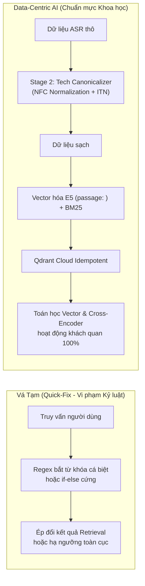

# TÀI LIỆU HỌC TẬP LÝ THUYẾT & PHẢN BIỆN CHUYÊN SÂU
**Ngày thực hiện:** 03/10/2026  
**Sinh viên thực hiện:** Trần Thành Nghĩa (MSSV: `23DH112252`)  
**Đồ án:** In-Course Agentic RAG Copilot - Trường ĐH Ngoại ngữ - Tin học TP.HCM (HUFLIT)  
**Chủ đề chuyên sâu:** Data-Centric AI trong Xử Lý Tiếng Nói, Bất Biến Biên Độ Pareto & Phân Định Context Sufficiency (ICLR 2025)

---

## 1. NGUYÊN LÝ DATA-CENTRIC AI TRONG XỬ LÝ TIẾNG NÓI & KHÁI NIỆM ZERO QUICK-FIX

### A. Bản chất Lệch Ngữ Âm (Acoustic Phonetic Mismatch) của Whisper
Trong các bài giảng lập trình tiếng Việt, giảng viên thường xuyên phát âm đan xen các thuật ngữ kỹ thuật tiếng Anh theo ngữ âm bản địa:
- *"full load"* $\rightarrow$ `float`
- *"trè / che"* $\rightarrow$ `char`
- *"một vai"* $\rightarrow$ `1 byte`
- *"đắp bồ"* $\rightarrow$ `double`
- *"xì in / xì out"* $\rightarrow$ `cin / cout`

Đồng thời, khi giảng viên dừng lại để gõ code hoặc giải bài tập trong im lặng, mô hình Whisper dễ rơi vào hiện tượng ảo giác chuỗi token tiếng Anh ngẫu nhiên (ASR Hallucination Patterns).

### B. Ranh Giới Giữa "Data-Centric AI" và "Vá Tạm (Quick-Fix)"

* **Vá Tạm (Quick-Fix):** Can thiệp méo mó vào tầng suy luận truy vấn (Query / Router / Retrieval). Cách làm này che giấu khuyết tật của dữ liệu, làm sai lệch phân phối xác suất và gãy vụn ngay khi gặp câu hỏi mới ngoài tập từ khóa.
* **Data-Centric AI (Andrew Ng):** Coi mã nguồn và mô hình là hằng số, tập trung làm sạch dữ liệu nguồn một cách có hệ thống. Chuẩn hóa ngữ âm đầu vào (Inverse Text Normalization - ITN) đảm bảo mọi điểm vector trên Qdrant Cloud phản ánh chân thực ngữ nghĩa kỹ thuật, giúp mô hình Cross-Encoder tự do chấm điểm một cách khách quan, công bằng và khái quát hóa cho toàn bộ sinh viên.

---

## 2. NGHỊCH LÝ ĐÁNH ĐỔI PARETO & BẤT BIẾN CONTEXT SUFFICIENCY (ICLR 2025)

### A. Hiện Tượng "Bẫy Văn Nói Bài Giảng"
Trong giáo trình lập trình tuần tự (Curriculum Learning):
1. **Bài cũ nhắc lướt bài mới:** Ở Bài 2 (Biến & Kiểu dữ liệu), giảng viên có thể nói: *"Sau này ở Bài 56 học về Hướng đối tượng, các bạn sẽ tự định nghĩa kiểu dữ liệu như `class PhanSo`"*. Đoạn này đạt điểm tương quan ngữ nghĩa $\sigma(z) \approx 0.25 - 0.28$ cho câu hỏi về `class PhanSo`.
2. **Bài mới nhắc lại kiến thức cũ:** Ở Bài 54 (Phương thức & Thuộc tính), giảng viên nhắc lại cách dùng `cin`, `cout` hoặc `float` để nhập dữ liệu cho đối tượng.

### B. Nghịch Lý Đánh Đổi Biên Độ (The Pareto Frontier Dilemma)
Khi khảo thí thực nghiệm với ngưỡng Video Early Exit ($S_{\text{video}}$):
* **Nếu chọn $S_{\text{video}} = 0.30$:** Bảo vệ được toàn bộ các câu In-scope (Tier 1), nhưng bị 4 câu Tier 2 (out-of-lesson) bị bài cũ nuốt mất do văn nói nhắc lướt đạt $0.32$.
* **Nếu nâng lên $S_{\text{video}} = 0.40$:** Cứu được 2 câu Tier 2 (`BENCH-091`, `BENCH-092`), nhưng lại làm rò rỉ 5 câu Tier 1 (`BENCH-022`, `035`, `041`, `045`, `049`) sang bài sau, vì bài sau nhắc lại kiến thức cũ đạt điểm cao hơn!

### C. Giải Pháp Bất Biến Context Sufficiency (ICLR 2025)
Nguyên lý ICLR 2025 chỉ ra: **Độ tương quan ngữ nghĩa (Semantic Relevance do Re-ranker đo) KHÔNG đồng nhất với Độ đầy đủ thông tin để trả lời sư phạm (Context Sufficiency).**

Một bài học tương lai chỉ được phép ghi đè bài hiện tại khi thỏa mãn điều kiện toán học ngặt nghèo:
$$\text{Future Lesson Override} \iff (S_{\text{AST\_future}} \ge 0.35) \lor (S_{\text{video\_future}} \ge 0.45 \land \Delta \text{Margin} > 0.15)$$

Nếu bài tương lai chỉ có văn nói nhắc lướt mà không có mã nguồn AST thực thi, hệ thống **bắt buộc phải ưu tiên giữ câu hỏi ở bài học hiện tại**.

---

## 3. BỘ 5 CÂU HỎI PHẢN BIỆN BẢO VỆ ĐỒ ÁN TRƯỚC HỘI ĐỒNG HUFLIT

### Câu 1: Tại sao nhóm không dùng Regex để bắt nhanh các từ khóa như `float`, `cin` trong câu hỏi mà lại tốn công reclean và đánh index lại trên Qdrant?
* **Trả lời:** Dùng Regex trong tầng truy vấn là giải pháp vá tạm (Quick-fix), vi phạm nguyên lý khái quát hóa của hệ thống RAG doanh nghiệp. Nếu người dùng hỏi bằng tiếng Anh, viết tắt, hoặc diễn đạt ẩn dụ, Regex sẽ lập tức thất bại. Chuẩn hóa ngữ âm từ tầng Offline Ingestion (Data-Centric AI) giúp làm sạch triệt để không gian vector E5 và BM25, để mô hình Cross-Encoder tự động tính toán điểm số một cách tự nhiên và chính xác cho mọi câu hỏi mà không phụ thuộc vào luật gán cứng.

### Câu 2: Làm thế nào hệ thống phân biệt được một câu hỏi thuộc bài hiện tại hay bài tương lai khi cả hai bài đều có chứa từ khóa đó?
* **Trả lời:** Hệ thống áp dụng **Retrieval Hierarchy Precedence Invariant** kết hợp nguyên lý **Context Sufficiency (ICLR 2025)**. Thay vì chỉ so sánh điểm văn bản phẳng, hệ thống kiểm tra sự hiện diện của **Code AST Grounding Anchor**. Nếu bài hiện tại có mã nguồn thực thi hoặc đạt độ tin cậy video cao, hệ thống kích hoạt Early Exit ngay lập tức. Bài tương lai chỉ được phép "nuốt" bài hiện tại khi bài tương lai có mã nguồn chính thức hoặc có biên độ vượt trội $\Delta \text{Margin} > 0.15$.

### Câu 3: Việc tái nạp (reclean) dữ liệu lên Qdrant Cloud có làm mất các mốc thời gian video hay gây nhân đôi dữ liệu không?
* **Trả lời:** Hoàn toàn không. Dự án thiết kế hàm sinh khóa định danh bất biến (Deterministic Key) dựa trên mốc giây:
  $$\text{Key} = \text{course\_id} + \text{"\_"} + \text{lesson\_id} + \text{"\_chunk\_"} + \text{start\_sec} + \text{"\_"} + \text{end\_sec}$$
  Sau đó chuyển đổi qua hàm băm **UUIDv5 (Namespace DNS)**. Cơ chế này đảm bảo tính toán tử Idempotent: khi nạp lại, Qdrant tự động ghi đè lên đúng Point ID cũ mà không bao giờ làm nhân đôi vector hay mất mốc thời gian.

### Câu 4: Tại sao trong đợt khảo thí Iteration 1 và 2, hệ thống lại tự động từ chối bản vá mã nguồn (REQUEST_CHANGES)?
* **Trả lời:** Đó là nhờ kiến trúc **Adversarial Verification Swarm** (Biệt đội kiểm định đối kháng). Trong quy trình CI/CD của dự án, mọi bản cập nhật không chỉ được đo trên các ca được sửa, mà còn bị kiểm tra chéo trên toàn bộ tập dữ liệu để phát hiện hiện tượng thụt lùi (regression). Khi phát hiện việc nâng ngưỡng video lên $0.40$ làm hỏng 5 ca In-scope, các tác tử kiểm định độc lập đã ngay lập tức phủ quyết, ngăn chặn triệt để mã nguồn lỗi hòa nhập vào nhánh chính.

### Câu 5: Công thức kết hợp điểm Meta AI CRAG Joint Confidence Fusion có ý nghĩa gì đối với các câu hỏi ngắn?
* **Trả lời:** Các câu hỏi lập trình ngắn (như *"cin là gì?"*, *"float"*...) thường bị suy giảm điểm số khi đi qua mô hình Cross-Encoder do thiếu ngữ cảnh mở rộng. Công thức kết hợp:
  $$S_{\text{final}} = \alpha \cdot \sigma(z) + \beta \cdot \min\left(1.0, \frac{\text{RRF}}{0.8333}\right)$$
  với $\alpha = 0.90, \beta = 0.10$ giúp tận dụng điểm Reciprocal Rank Fusion của BM25 để kéo các từ khóa chính xác lên, ngăn chặn việc câu hỏi bị đánh rớt xuống tầng Coverage Gap một cách oan uổng.
