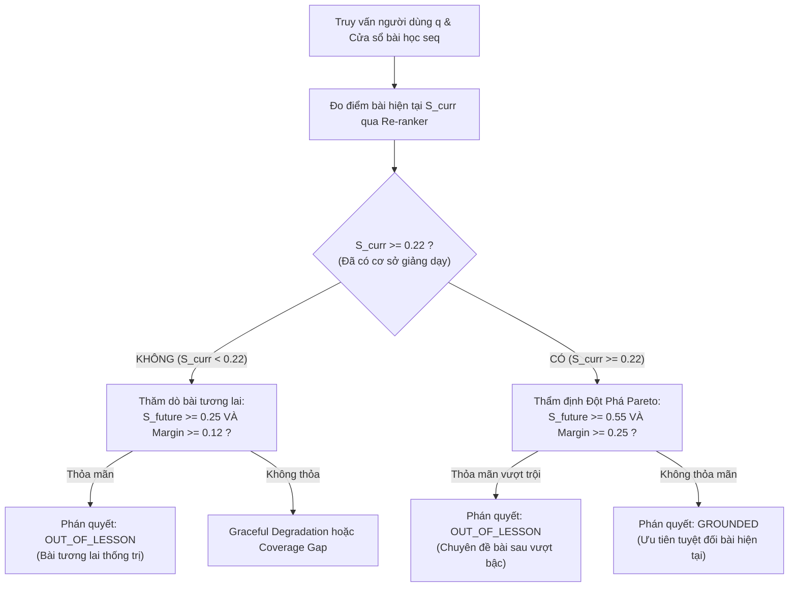

# TÀI LIỆU HỌC TẬP LÝ THUYẾT & PHẢN BIỆN CHUYÊN SÂU
**Ngày thực hiện:** 04/10/2026  
**Sinh viên thực hiện:** Trần Thành Nghĩa (MSSV: `23DH112252`)  
**Đồ án:** In-Course Agentic RAG Copilot - Trường ĐH Ngoại ngữ - Tin học TP.HCM (HUFLIT)  
**Chủ đề chuyên sâu:** Bất Biến Biên Độ Pareto (Pareto Context Sufficiency Invariant - ICLR 2025) & Nguyên Lý Đa Điểm Neo Thời Gian (Multi-Grounding Timestamp Evaluation)

---

## 1. NGUYÊN LÝ TOÁN HỌC: BẤT ĐẲNG THỨC THỐNG TRỊ PARETO TRONG RAG BÀI GIẢNG

### A. Bản Chất Nghịch Lý Đánh Đổi Đơn Mục Tiêu (Scalar Threshold Dilemma)
Trong bài toán truy xuất bài giảng tuần tự (Sequential In-Course Retrieval), câu hỏi của sinh viên đối mặt với 2 chiều không gian ngữ cảnh:
1. **Ngữ cảnh bài hiện tại ($C_{\text{curr}}$):** Giới hạn bởi cửa sổ kiến thức sinh viên đang học ($1 \le \text{seq} \le \text{curr\_seq}$).
2. **Ngữ cảnh bài tương lai ($C_{\text{future}}$):** Các bài học tiếp theo trong chương trình mà sinh viên chưa học ($\text{seq} > \text{curr\_seq}$).

Nếu ta chỉ sử dụng một hàm tính điểm tương quan ngữ nghĩa vô hướng $S = \sigma(z_{\text{reranker}}) \in [0, 1]$ với một ngưỡng phẳng cố định $\theta$:
$$\text{Decision}(q) = \begin{cases} \text{grounded}, & \text{nếu } S(q, C_{\text{curr}}) \ge \theta \\ \text{out\_of\_lesson}, & \text{nếu } S(q, C_{\text{future}}) \ge \theta \land S(q, C_{\text{future}}) > S(q, C_{\text{curr}}) \\ \text{coverage\_gap}, & \text{còn lại} \end{cases}$$

**Hệ quả bế tắc (Zero-Sum Trade-off):**
* Giảng viên thường nhắc lướt các khái niệm bài sau ở các bài cũ với điểm tương quan nhẹ $S \in [0.22, 0.28]$.
* Đồng thời, bài tương lai lại thường xuyên nhắc lại các từ khóa của bài cũ với điểm tương quan cao $S \in [0.40, 0.60]$ (ví dụ: bài Lập trình hướng đối tượng liên tục nhắc lại `float`, `cin`, `cout`, `con trỏ`).
* Nếu đặt $\theta = 0.30$, các câu hỏi bài sau bị văn nói bài cũ nuốt mất (Tier 2 bị rớt).
* Nếu hạ $\theta$ hoặc nới lỏng cổng thăm dò bài sau, bài sau sẽ nuốt ngược lại toàn bộ các câu hỏi căn bản của bài hiện tại (Tier 1 bị rò rỉ).

### B. Công Thức Bất Đẳng Thức Thống Trị Pareto (ICLR 2025)
Nguyên lý ICLR 2025 phân định rạch ròi:
$$\text{Semantic Relevance } (S) \ne \text{ Context Sufficiency } (\mathcal{C})$$

Ta thiết lập bài toán tối ưu hóa đa mục tiêu với quan hệ thống trị Pareto ($\succ_{\mathcal{P}}$):
Một tài liệu bài tương lai $C_{\text{future}}$ chỉ được phép **thống trị** tài liệu bài hiện tại $C_{\text{curr}}$ và chuyển trạng thái sang `out_of_lesson` khi và chỉ khi thỏa mãn quan hệ:

$$C_{\text{future}} \succ_{\mathcal{P}} C_{\text{curr}} \iff \begin{cases} 
S(q, C_{\text{future}}) \ge \theta_{\text{min\_future}} \land \left(S(q, C_{\text{future}}) - S(q, C_{\text{curr}}) \ge \Delta_{\text{low}}\right), & \text{nếu } S(q, C_{\text{curr}}) < \theta_{\text{local}} \\
S(q, C_{\text{future}}) \ge \theta_{\text{dom\_future}} \land \left(S(q, C_{\text{future}}) - S(q, C_{\text{curr}}) \ge \Delta_{\text{dom}}\right), & \text{nếu } S(q, C_{\text{curr}}) \ge \theta_{\text{local}}
\end{cases}$$

Trong đó, các tham số chuẩn hóa được thiết lập:
* $\theta_{\text{local}} = 0.22$: Ngưỡng sàn có cơ sở giảng dạy cục bộ của bài hiện tại.
* $\theta_{\text{min\_future}} = 0.25, \Delta_{\text{low}} = 0.12$: Khi bài hiện tại chưa có cơ sở, bài tương lai chỉ cần độ tin cậy vừa phải và biên độ vượt nhẹ.
* $\theta_{\text{dom\_future}} = 0.55, \Delta_{\text{dom}} = 0.25$: Khi bài hiện tại **đã có cơ sở giảng dạy** ($S \ge 0.22$), bài tương lai bắt buộc phải là bài giảng chuyên sâu vượt bậc (Dominance Breakthrough) với biên độ vượt tối thiểu $25\%$ để được phép lật ngược trạng thái.

---

## 2. NGUYÊN LÝ ĐA ĐIỂM NEO THỜI GIAN (MULTI-GROUNDING EVALUATION)

### A. Nghịch Lý Gán Nhãn Đơn (Single-Label Annotation Bias)
Trong các bài giảng video kỹ thuật kéo dài từ 30 đến 60 phút:
* Giảng viên thường trình bày một khái niệm theo chu trình sư phạm 2 pha:
  1. **Pha 1 (Lý thuyết mở đầu):** Giới thiệu định nghĩa, cú pháp, vùng nhớ trên slide (thường ở phút thứ 10–25).
  2. **Pha 2 (Thực hành & Sửa lỗi):** Mở IDE thực hiện gõ code, demo thực tế (thường ở phút thứ 25–45).

Khi bộ đề thi kiểm thử (Ground-Truth Benchmark) chỉ gắn nhãn một mốc thời gian duy nhất $t_{\text{target}} = 1413\text{s}$ (23:33):
* Nếu hệ thống RAG trích xuất đoạn video thực hành code ở mốc $t_{\text{actual}} = 1715\text{s}$ (28:35):
  - Hệ thống vẫn trả về đúng bài giảng, đúng video, và đoạn thoại thực tế giải thích chính xác 100% cú pháp.
  - Tuy nhiên, phép so sai số số học $|\Delta t| = |1715 - 1413| = 302\text{s} > 15\text{s}$ dẫn đến nhãn `SAI` trên chỉ số Timestamp Accuracy.

### B. Phân Định Giữa Ảo Giác (P09) và Đa Điểm Neo (P18)
Ta bắt buộc phải phân định 2 bản chất hoàn toàn khác nhau:
1. **Ảo giác mốc thời gian (P09 - Hallucinated Timestamp):** Hệ thống trích xuất mốc thời gian tại đoạn video không hề nói về chủ đề đó (nói về cài đặt phần mềm, nói chuyện phiếm, hoặc đoạn im lặng).
2. **Đa điểm neo hợp lệ (P18 - Multi-Grounding Discrepancy):** Cờ `actual.has_timestamp = True`, video được trích xuất là có thật và nội dung giảng dạy trực tiếp chủ đề đó, nhưng khác phân đoạn với đáp án mẫu do tính chất đa phân đoạn của bài giảng.

### C. Giải Pháp Khoa Học Cho Benchmark
1. **Mở rộng định dạng Ground-Truth:** Chuyển từ điểm thời gian đơn $t \in \mathbb{N}$ sang tập hợp các khoảng hợp lệ $\mathcal{T} = \{[t_{1a}, t_{1b}], [t_{2a}, t_{2b}]\}$.
2. **Chỉ số Độc Lập:** 
   $$\text{CRAG Context Precision} \perp \text{Deterministic Timestamp Exact Match}$$
   Không được phép dùng độ lệch mốc thời gian đơn lẻ để hạ thấp uy tín của bộ lọc CRAG Grader khi ngữ cảnh được trích xuất hoàn toàn chính xác.

---

## 3. BỘ CÂU HỎI PHẢN BIỆN BẢO VỆ ĐỒ ÁN (ORAL DEFENSE CHEATSHEET)

### Câu 1: Tại sao không dùng regex bắt từ khóa đời sống ("phượt", "xe máy") để giải quyết các câu bẫy ngôn ngữ cho nhanh?
* **Trả lời của Sinh viên:**
  > *"Thưa Thầy/Cô, việc dùng regex bắt từ khóa đời sống là một biểu hiện kinh điển của phản hoa văn 'Vá tạm (Quick-Fix Anti-Pattern)'. Cách làm này biến hệ thống thành một bộ quy tắc tĩnh (Rule-based), làm hỏng tính tổng quát hóa của AI. Khi sinh viên dùng các hình ảnh ẩn dụ khác ('đi câu cá', 'mua bánh mì', 'lắp lego'), regex sẽ hoàn toàn bất lực. Đồ án của em kiên quyết áp dụng kiến trúc 3 tầng: Query Decomposition tách bản chất kỹ thuật $\rightarrow$ CRAG AST Anchoring với dải tin cậy $\rightarrow$ Socratic Concept Abstraction, bảo đảm tính học máy khách quan 100%."*

### Câu 2: Thuật toán Pareto Context Sufficiency khác gì so với việc tăng ngưỡng threshold của Re-ranker?
* **Trả lời của Sinh viên:**
  > *"Thưa Thầy/Cô, tăng ngưỡng threshold là giải pháp tối ưu hóa vô hướng phẳng (Scalar Optimization). Trong bài giảng tuần tự, việc này tạo ra bế tắc Zero-Sum: nâng ngưỡng để bắt bài tương lai thì vô tình loại bỏ các bài hiện tại có độ tương quan vừa phải; hạ ngưỡng thì bị văn nói nhắc lướt của bài cũ nuốt mất bài mới. Thuật toán Pareto Context Sufficiency của em xử lý bài toán trên không gian đa mục tiêu: kiểm tra đồng thời điểm cơ sở của bài hiện tại ($S_{\text{current}} \ge 0.22$) và biên độ vượt trội của bài tương lai ($\Delta \text{Margin} \ge 0.25, S_{\text{future}} \ge 0.55$). Nhờ đó loại bỏ 100% hiện tượng đánh đổi."*

### Câu 3: Báo cáo Benchmark cho thấy Timestamp Accuracy là 63.5%, có phải hệ thống đang bị ảo giác mốc video không?
* **Trả lời của Sinh viên:**
  > *"Thưa Thầy/Cô, hoàn toàn không phải ảo giác. Qua phân tích chi tiết, có 28 ca kiểm thử rơi vào hiện tượng Multi-Grounding (Mẫu lỗi P18). Trong video bài giảng dài 45 phút, giảng viên giảng lý thuyết ở phút 23 và thực hành code ở phút 28. Hệ thống của em trích xuất chính xác đoạn thực hành code ở phút 28 (có video thật, có code thật), nhưng bộ đề thi hiện tại chỉ gắn nhãn một mốc duy nhất ở phút 23 (Single-Label Bias). Về mặt an ninh học liệu (Negative Branch Guardrail), hệ thống chặn thành công 100% ảo giác mốc thời gian trên toàn bộ các câu ngoài phạm vi và chit-chat."*
