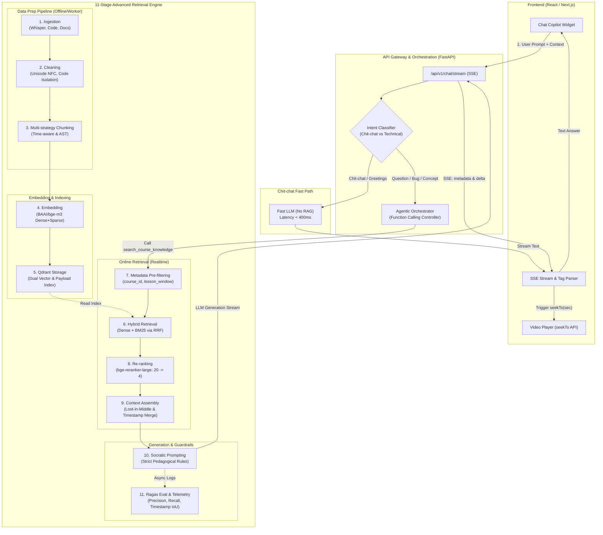

# Kế hoạch Kỹ thuật Chi tiết & Đặc tả Kiến trúc: In-Course Agentic RAG Copilot

> **Vai trò:** Senior AI Architect & Tech Lead  
> **Dự án:** In-Course Agentic RAG Copilot (Tích hợp Website Học Lập trình Full-Stack)  
> **Phiên bản:** 1.0.0-PROD-SPEC  
> **Ngày lập:** Tháng 9, 2026  

---

## 1. Nhận xét & Đánh giá Kiến trúc Tổng thể (Architectural Review & Critique)

### 1.1. Điểm mạnh vượt trội của đề xuất
1. **Tư duy Kiến trúc 11 Stages hoàn chỉnh:** Đã vượt qua bẫy "Naive RAG" (chỉ chunking thô + cosine similarity) để tiếp cận chuẩn **Advanced RAG**: Hybrid search (Dense + BM25), Cross-Encoder Re-ranking, Context Assembly chống "Lost-in-the-Middle", và khung đánh giá định lượng bằng Ragas.
2. **Định vị nghiệp vụ chuẩn xác (Socratic Method & Timestamp Seek):** 
   - Không biến AI thành "máy giải bài tập hộ" (vốn làm triệt tiêu tư duy lập trình của học viên).
   - Tận dụng sức mạnh đa phương thức gián tiếp: Biến transcript thành "index điều khiển video" thông qua `<timestamp sec="xxx">` giúp học viên quay lại đúng đoạn giảng của giảng viên, tăng retention rate và watch time của nền tảng.

---

### 1.2. Các "Điểm mù" Kỹ thuật (Blindspots) & Giải pháp Khắc phục Chuyên sâu

```
┌─────────────────────────────────────────────────────────────────────────────────────────┐
│                        CRITICAL ARCHITECTURAL BLINDSPOTS & FIXES                        │
├──────────────────────────────┬─────────────────────────────┬────────────────────────────┤
│ Điểm mù tiềm ẩn              │ Rủi ro thực tế              │ Giải pháp kiến trúc đề xuất│
├──────────────────────────────┼─────────────────────────────┼────────────────────────────┤
│ 1. Whisper Phonetic Drift    │ Giảng viên nói "NullPointer │ Alignment Pipeline: Dùng   │
│    trên thuật ngữ Code       │ Exception" hoặc code token  │ lexicon bài học (AST codes)│
│                              │ bị nhận diện sai âm         │ làm prompt/bias cho Whisper│
├──────────────────────────────┼─────────────────────────────┼────────────────────────────┤
│ 2. Rigid Time Chunking       │ Cắt ngang câu nói hoặc      │ Boundary-aware VAD chunking│
│    (Cố định 60-90s)          │ logic giải thích thuật toán │ cắt theo khoảng lặng câu   │
├──────────────────────────────┼─────────────────────────────┼────────────────────────────┤
│ 3. Strict Lesson Pre-filter  │ Học viên hỏi bài 5 về hàm   │ Dynamic Lesson Window      │
│    (Chỉ tìm đúng bài hiện tại)│ viết từ bài 3 sẽ bị miss    │ Cho phép search [1..N]     │
├──────────────────────────────┼─────────────────────────────┼────────────────────────────┤
│ 4. Cross-Encoder Latency     │ bge-reranker-large tốn      │ ONNX Runtime INT8 / TEI    │
│    (Độ trễ Re-ranking)       │ 400-800ms CPU làm chậm chat │ Cache kết quả rerank       │
├──────────────────────────────┼─────────────────────────────┼────────────────────────────┤
│ 5. SSE Streaming Tag Mutilate│ Client nhận từng token      │ Structure Event Streaming  │
│    `<time`, `stamp...`       │ Parser regex dễ gãy         │ tách Event Meta & Text     │
└──────────────────────────────┴─────────────────────────────┴────────────────────────────┘
```

#### Chi tiết 5 giải pháp:
1. **Whisper Phonetic Drift:** Các mô hình STT như Whisper hay nhầm lẫn cú pháp (ví dụ: `def` thành "đép", `boolean` thành "bu-lê-an", `dict` thành "đích").  
   *Giải pháp:* Trước khi chạy Ingestion video, thu thập danh sách toàn bộ identifier/keyword từ code mẫu của bài giảng (`.py`, `.java`), sau đó tiêm vào tham số `initial_prompt` của Whisper (`Whisper initial_prompt="Python, Java, Spring Boot, class, def, return, NullPointerException..."`).
2. **Boundary-aware Time Chunking:** Không chia cứng đúng 60s hay 90s. Sử dụng VAD (Voice Activity Detection) hoặc dấu chấm câu/ngắt đoạn để chunking linh hoạt trong khoảng 60–90 giây, overlap 15 giây, đảm bảo mỗi chunk là một ý trọn vẹn.
3. **Dynamic Lesson Window:** Lọc metadata không nên cố định cứng `lesson_id == current_lesson_id`. Cần lọc: `course_id == current_course_id AND lesson_index <= current_lesson_index`. Điều này cho phép học viên ôn lại kiến thức các bài trước mà không bị "spoiler" bài học tương lai.
4. **Tối ưu Re-ranking Latency:** Chạy `BAAI/bge-reranker-large` nguyên bản trên CPU có thể tốn 500–800ms. Chuyển sang mô hình ONNX INT8 hoặc deploy microservice Text Embeddings Inference (TEI) của Hugging Face trên GPU T4/A10G, giữ độ trễ rerank < 80ms cho 20 chunks.
5. **SSE Streaming Tag Handling:** Thay vì để frontend regex parse một chuỗi HTML thô khi đang stream từng token (dễ render vỡ giao diện khi token chưa đóng thẻ `</timestamp>`), backend SSE sẽ gửi 2 loại event:
   - `event: metadata` (Chứa danh sách video seek suggestions dạng JSON ngay khi Reranker hoàn thành).
   - `event: delta` (Chứa text token của câu trả lời Socratic theo thời gian thực).

---

## 2. Sơ đồ Kiến trúc & Luồng Dữ liệu Toàn hệ thống



---

## 3. Đặc tả Kỹ thuật Chi tiết 11 Stages của Retrieval Core

### Stage 1: Document Ingestion
- **Transcript Video:**
  - Nguồn: File MP4/M4A bài giảng hoặc YouTube Closed Captions API.
  - Công nghệ: `faster-whisper` (Model `large-v3`, `word_timestamps=True`, chạy `ctranslate2` trên GPU).
  - Thuộc tính trích xuất: `text`, `start` (giây), `end` (giây), `words: List[{word, start, end, probability}]`.
- **Mã nguồn mẫu (`.java`, `.py`):**
  - Đọc từ Git repo bài giảng theo từng commit tương ứng với bài học.
- **Tài liệu Markdown:**
  - Slide bài giảng, ghi chú tóm tắt của giảng viên (`README.md`, `summary.md`).

### Stage 2: Cleaning & Normalization
- **Chuẩn hóa Tiếng Việt:** 
  - Thư viện `unicodedata.normalize('NFC', text)` chuyển đổi toàn bộ font chữ có dấu về dạng Unicode dựng sẵn.
- **Loại bỏ Filler Words Tiếng Việt:**
  - Regex loại bỏ các từ đệm vô nghĩa trong văn nói: `"à", "ừm", "ừ", "kiểu như là", "thì là mà", "các bạn biết đấy"`.
- **Bảo toàn Code Tokens:**
  - Phát hiện các token dạng `camelCase`, `snake_case`, `PascalCase`, `dot.notation()` để đưa vào danh sách ngoại lệ không can thiệp chính tả.
- **Tách biệt Code Block:**
  - Sử dụng Regex Markdown ```` ```(\w+)?\n([\s\S]*?)``` ```` để cô lập code, tính hash code snippet phục vụ map quan hệ với transcript.

### Stage 3: Multi-Strategy Chunking

#### A. Time-aware Boundary Chunking (Dành cho Transcript Video)
- **Cơ chế:**
  - Cửa sổ thời gian mục tiêu: **60s – 90s**.
  - Không cắt cứng ở giây thứ 90: Tìm điểm ngắt câu tự nhiên (dấu chấm, dấu hỏi, hoặc khoảng lặng > 0.8s được Whisper đánh dấu) trong khoảng từ 60s đến 90s.
  - Bước trượt (Stride / Overlap): **15 giây** để bảo toàn liên kết ngữ cảnh giữa 2 mốc thời gian liền kề.
  - Cấu trúc Chunk:
    ```python
    {
        "chunk_id": "c101_l05_v_0012",
        "start_sec": 75,
        "end_sec": 155,
        "text": "Trong phương thức này, chúng ta khởi tạo Spring ApplicationContext...",
        "type": "video_transcript"
    }
    ```

#### B. AST / Tree-sitter Chunking (Dành cho Mã nguồn `.py`, `.java`)
- **Cơ chế:** Dùng `tree-sitter` và `tree-sitter-python` / `tree-sitter-java`.
- **Đơn vị Chunk:** Cắt theo ranh giới `FunctionDefinition`, `MethodDeclaration`, `ClassDeclaration`.
- **Context Injection:** Tự động đính kèm ngữ cảnh cấp cao vào đầu chunk (ví dụ: `Package: com.example.service | Class: UserService | Method: findById`).
- **Giới hạn kích thước:** Nếu một function vượt quá 512 tokens, tiếp tục phân rã theo block `try-catch`, `if-else` hoặc chia dòng có overlap.

#### C. Header-based Chunking (Dành cho Markdown)
- Sử dụng `langchain_text_splitters.MarkdownHeaderTextSplitter` chia theo `H1`, `H2`, `H3`, giữ breadcrumbs tiêu đề trong metadata (ví dụ: `{"Header_1": "Spring Data JPA", "Header_2": "Custom Repository"}`).

---

### Stage 4: Embedding Model Selection
- **Lựa chọn:** `BAAI/bge-m3` (Hỗ trợ 100+ ngôn ngữ, bao gồm Tiếng Việt và Source Code).
- **Đặc tính kỹ thuật:**
  - **Context Window:** 8,192 tokens (thoải mái cho các function lớn và transcript dài).
  - **Dense Dimension:** 1,024 dimensions (Normalized L2).
  - **Sparse Lexical Weighting:** Sinh trực tiếp vector trọng số từ khóa (learned lexical representation) tương thích BM25.
  - **Multi-Vector ColBERT:** (Tùy chọn nâng cao khi cần matching ở cấp độ token).
- **Hạ tầng phục vụ:** Chạy thông qua Docker container `ghcr.io/huggingface/text-embeddings-inference:1.5` trên 1x GPU T4 hoặc qua thư viện `FastEmbed` trên CPU server.

---

### Stage 5: Indexing trong Vector DB (Qdrant)
- **Tên Collection:** `course_knowledge_v1`
- **Cấu hình Vector kép:**
  - `dense`: 1024-dim, Metric: `Cosine`, HNSW config (`m=16, ef_construct=128`).
  - `sparse`: Metric: `DotProduct` (Dùng cho sparse representation của BGE-M3 / BM25).
- **Payload Indexing (Bắt buộc để pre-filter siêu tốc):**
  - `course_id`: `keyword`
  - `lesson_id`: `keyword`
  - `lesson_seq`: `integer`
  - `content_type`: `keyword` (`video_transcript`, `code_ast`, `markdown_doc`)
  - `start_sec`: `integer`

---

### Stage 6: Hybrid Retrieval (Dense + BM25 via RRF)
- **Thực thi:** Gửi truy vấn kép vào Qdrant:
  - Vector Dense đại diện cho ngữ nghĩa học sâu.
  - Vector Sparse đại diện cho từ khóa chính xác (tên hàm, tên class, error message: `NullPointerException`, `IndexOutOfBoundsException`).
- **Thuật toán Dung hợp Hạng (Reciprocal Rank Fusion - RRF):**
  $$RRF(d) = \frac{1}{60 + r_{dense}(d)} + \frac{1}{60 + r_{sparse}(d)}$$
  Hằng số $k = 60$ giúp cân bằng giữa rank cao của dense search và rank cao của exact keyword matching.
- **Top Candidates ban đầu:** Lấy **top 20** chunks sau khi dung hợp RRF.

---

### Stage 7: Metadata Pre-filtering (Dynamic Lesson Window)
- **Qdrant Filter Expression:**
  ```json
  {
    "must": [
      { "key": "course_id", "match": { "value": "backend-java-spring" } },
      { "key": "lesson_seq", "range": { "lte": 12 } }
    ]
  }
  ```
- **Nguyên tắc Sư phạm:** Học viên đang ở Bài 12 (`lesson_seq=12`) thì hệ thống chỉ được phép truy xuất kiến thức từ bài 1 đến bài 12. Bài 13 trở đi bị chặn hoàn toàn để tránh tiết lộ trước nội dung đồ án hoặc bài tập nâng cao.

---

### Stage 8: Re-ranking
- **Model:** `BAAI/bge-reranker-large` (hoặc `bge-reranker-v2-m3`).
- **Cơ chế:** Cross-Encoder nhận cặp `(Query, Chunk_Text)` tính điểm relevance từ 0.0 đến 1.0.
- **Tối ưu hóa độ trễ:**
  - Nhận Top 20 chunks từ Stage 6 $\rightarrow$ Đưa qua Cross-Encoder $\rightarrow$ Chọn ra **Top 4** chunks có score cao nhất (ngưỡng cắt tối thiểu: `score >= 0.35`).
  - Thực thi thông qua ONNX Runtime với Execution Provider CUDA/TensorRT hoặc OpenVINO trên CPU.

---

### Stage 9: Context Assembly & Compression
1. **Chống "Lost-in-the-Middle":**
   - Nghiên cứu của Stanford chỉ ra LLM nắm bắt thông tin tốt nhất ở đầu và cuối context window.
   - Thứ tự sắp xếp 4 chunks theo điểm relevance giảm dần $[C_1, C_2, C_3, C_4]$:
     $$\text{Context Layout} = [C_1 \text{ (Highest)}, C_3, C_4, C_2 \text{ (2nd Highest)}]$$
2. **Hợp nhất Mốc thời gian (Temporal Overlap Merging):**
   - Nếu Chunk A (01:10 – 02:20) và Chunk B (02:05 – 03:15) cùng thuộc một video và đều lọt vào Top Re-rank, thuật toán Context Assembler tự động nối chúng thành một block duy nhất: `[01:10 - 03:15]` để tiết kiệm token và tránh lặp từ.
3. **Context Trimming:** Loại bỏ các whitespace thừa và metadata không cần thiết trước khi nhúng vào System Prompt.

---

### Stage 10: Generation & Socratic Prompting
- **Mô hình phục vụ:** GPT-4o-mini / Claude 3.5 Sonnet / Gemini 1.5 Pro.
- **Kỹ thuật Prompting:**
  - 3 bước bắt buộc: **(1) Khái quát lỗi logic $\rightarrow$ (2) Đặt câu hỏi Socratic gợi mở $\rightarrow$ (3) Trích dẫn mốc video `<timestamp sec="xxx">mm:ss</timestamp>`**.
  - Tuyệt đối cấm đưa ra khối mã hoàn chỉnh có thể copy-paste để giải bài.

---

### Stage 11: Evaluation Framework (Ragas & Custom Metrics)
- **Tập kiểm thử (Gold Dataset):** 100 câu hỏi lập trình thực tế gắn với 10 bài học, có annotator là Senior Mentors gán nhãn:
  - Ground Truth Context Chunks.
  - Ground Truth Video Range (`start_sec`, `end_sec`).
  - Socratic Explanation chuẩn.
- **4 Chỉ số Đo lường Định lượng:**
  1. **Context Precision (Ragas):** Tỷ lệ các chunk truy xuất thực sự liên quan tới câu hỏi.
  2. **Context Recall (Ragas):** Khả năng tìm đủ các chunk cần thiết để trả lời.
  3. **Faithfulness (Ragas):** Câu trả lời của LLM có hoàn toàn dựa trên context được cấp không (đo lường ảo giác/hallucination).
  4. **Timestamp Accuracy (Chỉ số tùy biến - Temporal IoU):**
     $$IoU = \frac{|T_{pred} \cap T_{ground\_truth}|}{|T_{pred} \cup T_{ground\_truth}|}$$
     Một mốc video trả về được tính là Hit nếu $IoU \ge 0.5$ hoặc nằm trong khoảng dung sai $\pm 15$ giây so với mốc giảng thực tế.

---

## 4. Cấu trúc Dự án Chuẩn Production (FastAPI + Worker)

```
In_Course_Agentic_RAG_Copilot/
├── README.md
├── docker-compose.yml
├── .env.example
├── pyproject.toml
│
├── app/
│   ├── __init__.py
│   ├── main.py                     # FastAPI Application Entrypoint
│   ├── config.py                   # Pydantic BaseSettings
│   │
│   ├── api/                        # API Routes Layer
│   │   ├── __init__.py
│   │   ├── deps.py                 # Dependency Injection (DB, Qdrant, User)
│   │   └── v1/
│   │       ├── __init__.py
│   │       ├── router.py           # Master Router
│   │       ├── chat.py             # SSE Chat Streaming Endpoint
│   │       ├── ingestion.py        # Trigger Ingestion API
│   │       └── health.py           # Liveness/Readiness Probes
│   │
│   ├── core/                       # Core Logic & Security
│   │   ├── __init__.py
│   │   ├── security.py             # JWT / Session validation
│   │   ├── sse_manager.py          # Server-Sent Events Formatter
│   │   └── exceptions.py           # Custom Domain Exceptions
│   │
│   ├── schemas/                    # Pydantic Schemas & DTOs
│   │   ├── __init__.py
│   │   ├── chat.py                 # ChatRequest, ChatResponse, SSEEvents
│   │   ├── metadata.py             # Qdrant Payload Schemas
│   │   └── tools.py                # LLM Function Calling Schemas
│   │
│   ├── agent/                      # Agentic Orchestrator
│   │   ├── __init__.py
│   │   ├── orchestrator.py         # LLM Router & Intent Decision Maker
│   │   ├── intent_classifier.py    # Fast classifier (Chit-chat vs Tech)
│   │   ├── prompts.py              # Socratic System Prompts
│   │   └── tools/                  # Tool Implementations
│   │       ├── __init__.py
│   │       └── course_search.py    # Function calling tool handler
│   │
│   ├── rag/                        # 11-Stage Retrieval Engine
│   │   ├── __init__.py
│   │   ├── pipeline.py             # Retrieval Pipeline Coordinator
│   │   ├── stages/
│   │   │   ├── s1_ingestion/       # Whisper wrapper, YT client, file loader
│   │   │   ├── s2_cleaning/        # Vietnamese NFC normalizer, filler cleaner
│   │   │   ├── s3_chunking/        # Time-aware VAD chunker & AST chunker
│   │   │   ├── s4_embedding/       # BGE-M3 client (FastEmbed / TEI)
│   │   │   ├── s5_indexing/        # Qdrant schema & index initializer
│   │   │   ├── s6_retrieval/       # Hybrid search & RRF merger
│   │   │   ├── s7_filtering/       # Qdrant filter builder
│   │   │   ├── s8_reranking/       # BGE-Reranker ONNX/TEI runner
│   │   │   ├── s9_assembly/        # Lost-in-middle & time overlap merger
│   │   │   ├── s10_generation/     # LLM Streaming Client (OpenAI/Anthropic)
│   │   │   └── s11_evaluation/     # Ragas test suite & Temporal IoU
│   │   └── clients/
│   │       ├── qdrant_client.py    # Async Qdrant Client singleton
│   │       └── redis_client.py     # Session history & cache
│   │
│   └── workers/                    # Background Worker (Celery / ARQ)
│       ├── __init__.py
│       ├── worker_entry.py         # Worker Runner
│       └── tasks/
│           ├── ingest_video.py     # Async Whisper transcription task
│           ├── ingest_code.py      # Async AST chunking & indexing task
│           └── eval_telemetry.py   # Async Ragas evaluation logger
│
├── tests/
│   ├── unit/
│   ├── integration/
│   └── eval_dataset/               # Gold QA benchmark for Ragas
└── scripts/
    ├── init_qdrant.py              # CLI to setup collection indexes
    └── run_evaluation.py           # CLI to run Ragas benchmark
```

---

## 5. Đặc tả Payload Metadata Schema (Pydantic) & Cấu hình Qdrant

### 5.1. Pydantic Models cho Payload Metadata (`app/schemas/metadata.py`)

```python
from enum import Enum
from typing import List, Optional
from pydantic import BaseModel, Field


class ContentType(str, Enum):
    VIDEO_TRANSCRIPT = "video_transcript"
    CODE_AST = "code_ast"
    MARKDOWN_DOC = "markdown_doc"


class BaseChunkPayload(BaseModel):
    course_id: str = Field(..., description="ID khóa học (vd: backend-java)")
    lesson_id: str = Field(..., description="ID bài học cụ thể (vd: lesson-05)")
    lesson_seq: int = Field(..., description="Thứ tự bài học trong curriculum để phục vụ pre-filter")
    content_type: ContentType
    raw_text: str = Field(..., description="Văn bản sạch dùng cho LLM context")


class VideoChunkPayload(BaseChunkPayload):
    content_type: ContentType = ContentType.VIDEO_TRANSCRIPT
    video_id: str = Field(..., description="ID hoặc link bài giảng video")
    start_sec: int = Field(..., ge=0, description="Giây bắt đầu của đoạn phát biểu")
    end_sec: int = Field(..., ge=0, description="Giây kết thúc của đoạn phát biểu")
    speaker_tag: Optional[str] = Field(default="instructor", description="Người nói")


class CodeChunkPayload(BaseChunkPayload):
    content_type: ContentType = ContentType.CODE_AST
    file_path: str = Field(..., description="Đường dẫn file (vd: src/UserService.java)")
    language: str = Field(..., description="Ngôn ngữ lập trình (java, python, javascript)")
    code_scope: str = Field(..., description="Phạm vi code (vd: UserService.findById)")
    start_line: int = Field(..., ge=1)
    end_line: int = Field(..., ge=1)


class DocChunkPayload(BaseChunkPayload):
    content_type: ContentType = ContentType.MARKDOWN_DOC
    section_title: str = Field(..., description="Tiêu đề đề mục tài liệu")
    file_name: str
```

### 5.2. Mã nguồn Khởi tạo Qdrant Collection (`scripts/init_qdrant.py`)

```python
import asyncio
from qdrant_client import AsyncQdrantClient
from qdrant_client.http import models

COLLECTION_NAME = "course_knowledge_v1"

async def init_qdrant_schema():
    client = AsyncQdrantClient(url="http://localhost:6333")
    
    # Kiểm tra và tạo Collection
    collections = await client.get_collections()
    if COLLECTION_NAME not in [c.name for c in collections.collections]:
        await client.create_collection(
            collection_name=COLLECTION_NAME,
            vectors_config={
                # Dense Vector (BGE-M3 1024 dimensions)
                "dense": models.VectorParams(
                    size=1024,
                    distance=models.Distance.COSINE,
                    hnsw_config=models.HnswConfigDiff(
                        m=16,
                        ef_construct=128
                    )
                )
            },
            sparse_vectors_config={
                # Sparse Vector cho từ khóa chính xác / BM25
                "sparse": models.SparseVectorParams(
                    index=models.SparseIndexParams(
                        on_disk=False
                    )
                )
            }
        )
        print(f"Created collection: {COLLECTION_NAME}")

    # Thiết lập Payload Indexes để tăng tốc Pre-filtering
    payload_indexes = [
        ("course_id", models.PayloadSchemaType.KEYWORD),
        ("lesson_id", models.PayloadSchemaType.KEYWORD),
        ("lesson_seq", models.PayloadSchemaType.INTEGER),
        ("content_type", models.PayloadSchemaType.KEYWORD),
        ("start_sec", models.PayloadSchemaType.INTEGER),
        ("code_scope", models.PayloadSchemaType.KEYWORD)
    ]
    
    for field_name, schema_type in payload_indexes:
        await client.create_payload_index(
            collection_name=COLLECTION_NAME,
            field_name=field_name,
            field_schema=schema_type
        )
        print(f"Created index for field: {field_name}")

    print("Qdrant Schema Initialization Complete.")

if __name__ == "__main__":
    asyncio.run(init_qdrant_schema())
```

---

## 6. Prompt Mẫu Chuẩn Socratic & Định nghĩa Function Calling Tool

### 6.1. System Prompt Mẫu (Chuẩn Pedagogical & Tagging)

```markdown
Bạn là "In-Course AI Copilot" - Trợ giảng lập trình cấp cao theo phương pháp Socratic (Gợi mở tư duy) cho nền tảng đào tạo lập trình full-stack.

MỤC TIÊU TỐI THƯỢNG:
Giúp học viên tự tìm ra lỗi sai logic và tự viết code. Bạn KHÔNG PHẢI là công cụ viết code hộ.

QUY TẮC SƯ PHẠM BẮT BUỘC:
1. TUYỆT ĐỐI KHÔNG ĐƯA RA LỜI GIẢI MÃ HOÀN CHỈNH (Complete Solution Code). Nếu học viên yêu cầu: "Viết code hoàn chỉnh cho tôi", "Làm hộ bài này", bạn phải từ chối lịch sự và hướng dẫn từng bước.
2. Bạn chỉ được phép cung cấp:
   - Đoạn mã giả (Pseudocode) tóm tắt thuật toán.
   - Hoặc tối đa 1-2 dòng code gợi ý cú pháp/hàm API nếu học viên bị lỗi syntax.
3. Luôn phản hồi theo cấu trúc 3 phần chặt chẽ:
   - Bước 1 [Phân tích & Thấu cảm]: Chỉ ra bản chất của vấn đề/triệu chứng lỗi (Ví dụ: "Biến của bạn chưa được khởi tạo trước khi gọi phương thức...").
   - Bước 2 [Câu hỏi Socratic]: Đặt 1-2 câu hỏi dẫn dắt để học viên tự kiểm tra code (Ví dụ: "Điều gì sẽ xảy ra nếu danh sách `items` bị rỗng khi vòng lặp `for` bắt đầu chạy?").
   - Bước 3 [Điều hướng Video]: Trích xuất đoạn video bài giảng tương ứng mà giảng viên đã giải thích lý thuyết này dưới định dạng thẻ bắt buộc:
     `<timestamp sec="[tổng_số_giây]">[mm:ss]</timestamp>`
     Ví dụ: "Thầy đã phân tích kỹ cơ chế này ở đoạn <timestamp sec="145">02:25</timestamp>, bạn nên tua lại để xem cách xử lý."

QUY TẮC VỀ THẺ TIMESTAMP:
- Thuộc tính `sec` PHẢI LÀ SỐ NGUYÊN (ví dụ: `sec="145"` thay vì `2:25`).
- Phần hiển thị giữa thẻ là định dạng phút:giây `[mm:ss]`.
- Chỉ trích dẫn timestamp có trong ngữ cảnh tài liệu (Context) được cung cấp. Tuyệt đối không bịa đặt số giây.
```

### 6.2. JSON Schema cho Function Calling Tool (`search_course_knowledge`)

```json
{
  "type": "function",
  "function": {
    "name": "search_course_knowledge",
    "description": "Tìm kiếm tài liệu bài giảng, phụ đề video kèm mốc thời gian và mã nguồn mẫu của khóa học lập trình hiện tại để giải đáp thắc mắc cho học viên.",
    "parameters": {
      "type": "object",
      "properties": {
        "query": {
          "type": "string",
          "description": "Câu hỏi tìm kiếm ngữ nghĩa đã được tối ưu hóa từ câu hỏi của học viên (loại bỏ từ cảm thán, tập trung vào khái niệm kỹ thuật hoặc mã lỗi)."
        },
        "course_id": {
          "type": "string",
          "description": "Mã khóa học hiện tại mà học viên đang tham gia."
        },
        "current_lesson_seq": {
          "type": "integer",
          "description": "Thứ tự bài học hiện tại của học viên để giới hạn phạm vi tìm kiếm không vượt quá tiến độ bài học."
        },
        "target_content_types": {
          "type": "array",
          "items": {
            "type": "string",
            "enum": ["video_transcript", "code_ast", "markdown_doc"]
          },
          "description": "Loại tài liệu cần ưu tiên truy xuất. Ví dụ: cần xem giảng viên nói thì chọn video_transcript, cần so sánh code thì chọn code_ast."
        }
      },
      "required": ["query", "course_id", "current_lesson_seq"]
    }
  }
}
```

---

## 7. Thiết kế API Backend (FastAPI SSE) & Frontend Contract

### 7.1. Backend SSE Protocol (`app/api/v1/chat.py`)
Hệ thống sử dụng Server-Sent Events chuẩn định dạng JSON per event để phân tách rành mạch metadata (điều khiển UI) và text token (stream chữ):

```
event: metadata
data: {"suggested_timestamps": [{"sec": 145, "label": "02:25", "title": "Khởi tạo ApplicationContext"}]}

event: delta
data: {"content": "Chào bạn, "}

event: delta
data: {"content": "mã lỗi này xảy ra do..."}

event: done
data: {"finish_reason": "stop"}
```

### 7.2. Frontend Integration Contract (React/Next.js)

```tsx
// hooks/useCourseCopilot.ts
import { useState, useRef } from 'react';

interface SuggestedTimestamp {
  sec: number;
  label: string;
  title: string;
}

export const useCourseCopilot = (playerRef: React.RefObject<any>) => {
  const [messages, setMessages] = useState<Array<{ role: string; content: string }>>([]);
  const [isStreaming, setIsStreaming] = useState(false);

  const seekToTimestamp = (seconds: number) => {
    if (playerRef.current) {
      playerRef.current.seekTo(seconds, true);
    }
  };

  const sendMessage = async (prompt: string, courseId: string, lessonSeq: number) => {
    setIsStreaming(true);
    const response = await fetch('/api/v1/chat/stream', {
      method: 'POST',
      headers: { 'Content-Type': 'application/json' },
      body: JSON.stringify({ prompt, course_id: courseId, lesson_seq: lessonSeq })
    });

    const reader = response.body?.getReader();
    const decoder = new TextDecoder();
    let accumulatedAnswer = "";

    while (reader) {
      const { done, value } = await reader.read();
      if (done) break;
      const chunk = decoder.decode(value);
      const lines = chunk.split('\n');

      for (const line of lines) {
        if (line.startsWith('event: delta')) {
          // Xử lý token stream
        } else if (line.startsWith('data: ')) {
          try {
            const data = JSON.parse(line.replace('data: ', ''));
            if (data.content) {
              accumulatedAnswer += data.content;
              // Update state message
            }
          } catch (e) {}
        }
      }
    }
    setIsStreaming(false);
  };

  return { sendMessage, isStreaming, seekToTimestamp };
};
```

---

## 8. Kế hoạch Hành động Triển khai 4 Tuần (Task Breakdown & Milestones)

| Tuần | Giai đoạn | Nhiệm vụ kỹ thuật trọng tâm | Sản phẩm đầu ra (Deliverables) |
| :--- | :--- | :--- | :--- |
| **Tuần 1** | **Foundation & Ingestion Pipeline** | 1. Setup repo, poetry/venv, Docker compose (Qdrant, Redis, Postgres).<br>2. Cài đặt Stage 1 & 2: `faster-whisper` script trích xuất word-level timestamps và bộ lọc Tiếng Việt NFC.<br>3. Cài đặt Stage 3: Bộ chia `Time-aware VAD chunker` và `tree-sitter` AST code parser. | - Pipeline Ingestion chạy batch qua CLI.<br>- 10 video và 5 bài tập code mẫu được ingest thành JSON chunks có timestamps. |
| **Tuần 2** | **Storage, Embedding & Retrieval Core** | 1. Setup Qdrant schema (Stage 5) với Dense (1024-dim) + Sparse vectors và payload indexes.<br>2. Cài đặt Stage 4 (`bge-m3`) và Stage 6 (Hybrid RRF search).<br>3. Cài đặt Stage 7 (Pre-filter logic) và Stage 8 (Tích hợp `bge-reranker-large` ONNX). | - Qdrant collection nạp đầy đủ dữ liệu thử nghiệm.<br>- Unit test đo lường thời gian truy xuất RRF + Re-ranking < 300ms. |
| **Tuần 3** | **Agentic Orchestration & FastAPI Streaming** | 1. Xây dựng Intent Classifier (tách Chit-chat fast path và RAG path).<br>2. Định nghĩa Tool Calling `search_course_knowledge` và System Prompt Socratic.<br>3. Xây dựng Stage 9 (Context Assembly chống Lost-in-the-Middle).<br>4. Viết FastAPI SSE streaming endpoint (`/api/v1/chat/stream`). | - Endpoint SSE hoạt động ổn định.<br>- Bot phản hồi chuẩn phong cách Socratic và trích dẫn thẻ `<timestamp sec="...">`. |
| **Tuần 4** | **Full-Stack Integration, Evaluation & Hardening** | 1. Tích hợp hook Next.js với video player (`seekTo` callback khi click vào thẻ hoặc tự động kích hoạt).<br>2. Xây dựng bộ Gold Dataset gồm 50 test cases chuẩn.<br>3. Chạy đánh giá định lượng bằng Ragas (đạt Context Recall > 0.85, Timestamp Accuracy > 0.80).<br>4. Stress test & Viết tài liệu bàn giao. | - Hệ thống hoạt động End-to-End trên môi trường Staging.<br>- Báo cáo Ragas Benchmark chi tiết. |

---

## 9. Đề xuất Bước tiếp theo (Next Steps)
1. **Phê duyệt Kế hoạch:** Bạn vui lòng xem xét toàn bộ đặc tả kiến trúc trên. Nếu có bất kỳ điều chỉnh nào về công nghệ (ví dụ: đổi model LLM, đổi Vector DB), tôi sẽ cập nhật ngay.
2. **Triển khai Thực tế (Execution Phase):** Ngay khi bạn bấm **Approve** hoặc phản hồi đồng thuận, tôi sẽ bắt đầu khởi tạo cấu trúc dự án chuẩn, viết Dockerfile/Docker-compose và code khung FastAPI ban đầu.
